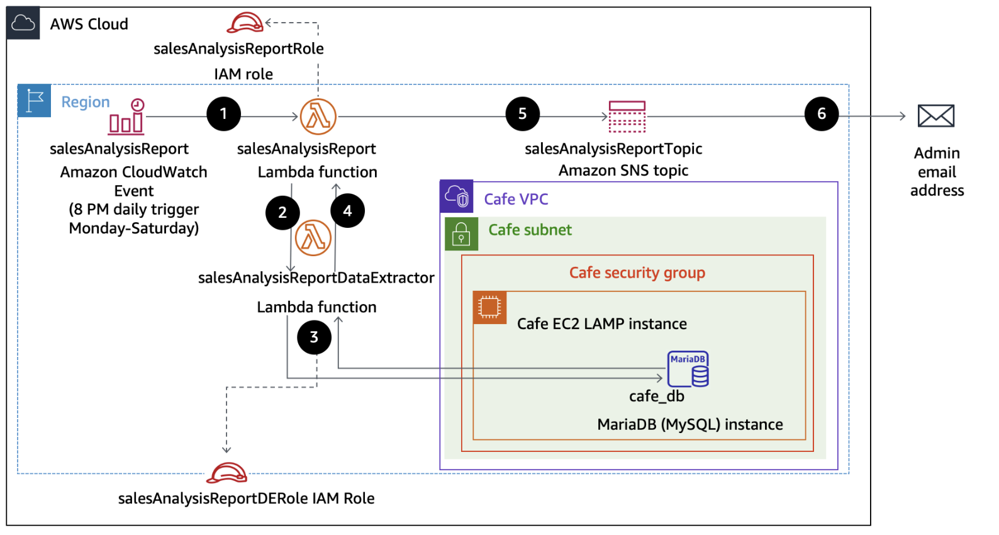
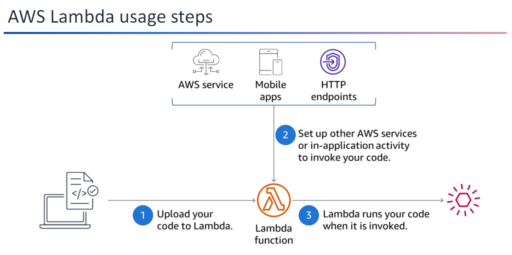

## AWS Lambda

AWS Lambda is a powerful, fully managed compute service that automatically runs your code in response to specific events, managing the compute resources required. This operates on a **serverless model**, which means developers do not need to provision, manage, or maintain servers. Instead, the underlying infrastructure is fully abstracted, allowing you to focus solely on writing and deploying application code.

This serverless approach enables you to quickly deploy ideas into modern, production-ready applications while ensuring scalability and reliability. Whether you're processing data streams, executing backend logic for web and mobile applications, or triggering workflows based on changes in a data store, `AWS Lambda` can seamlessly respond to a wide variety of events from AWS services like `S3`, `DynamoDB`, or `API Gateway`.

Lambda automatically handles provisioning, scaling, and maintenance of compute resources, allowing your application to scale from a few requests per day to thousands per second without additional configuration. By using the pay-as-you-go pricing model, where you only pay for the compute time consumed by your code, Lambda offers a cost-effective solution for production workloads.

With support for various programming languages and the ability to upload custom code, AWS Lambda is an ideal tool for developers looking to build resilient, scalable, and modern serverless applications efficiently and effectively.



## Serverless Model

The serverless model is a cloud computing execution framework where the cloud provider dynamically manages the provisioning, scaling, and maintenance of servers. Despite the name, servers are still involved, but developers don’t need to interact with or manage them directly.

Key Features of the Serverless Model:

1. **No Server Management:**
   Developers focus on writing code, while the cloud provider handles all backend infrastructure tasks, such as provisioning, scaling, and maintenance.

2. **Event-Driven Execution:**
   Applications or functions are executed in response to events, such as database updates, API requests, or file uploads.

3. **Automatic Scaling:**
   The service scales automatically based on demand, handling fluctuations from a few requests to thousands per second.

4. **Pay-As-You-Go:**
   Billing is based only on the compute resources used (e.g., execution time and memory), making it cost-efficient.

**AWS Lambda**

-   Is a fully managed service for serverless compute
-   Provides event-driven invocation•Offers subsecond metering
-   Limits the runtime of a function to a maximum of 15 minutes
-   Supports multiple programming languages
-   You can use any third-party library, even native ones. Lambda includes support for Java, Node.js, C#, Python, Ruby, Go, and Powershell.



Steps to Use AWS Lambda:

1. Upload Your Code:
   Begin by uploading your application code to AWS Lambda. The service handles all the necessary provisioning, scaling, and maintenance of the underlying infrastructure, ensuring your code runs with high availability.

2. Set Up Invocation:
   Configure your Lambda function to be triggered by events from other AWS services (e.g., S3, DynamoDB, or API Gateway). Alternatively, you can invoke the function directly from a web or mobile application, or through an HTTP endpoint.

3. Pay-As-You-Go Execution:
   AWS Lambda executes your code only when triggered. Billing is based solely on the compute time your function uses, making it a cost-efficient solution. No charges apply when your code is idle.

### AWS Lambda Layers

AWS Lambda layers allow developers to extend the functionality of their Lambda functions by adding external code, libraries, and other resources. This feature helps streamline development and optimize the deployment process.

**Benefits of Using Layers**:

-   **Use External Libraries**: Configure a Lambda function to use libraries not included in the deployment package.
-   **Reduce Deployment Package Size**: Keep your deployment package small, improving manageability and deployment speed.
-   **Avoid Dependency Errors**: Minimize errors caused by package dependencies in your function code.
-   **Enable Code Sharing**: Share libraries or other common resources across multiple developers and Lambda functions.

**How Layers Work**:

A Lambda layer is a `.zip` archive that contains:

-   Libraries
-   Data files
-   Configuration files
-   Custom runtimes

You can configure your Lambda function to pull in additional code and content from up to **five layers** simultaneously. This modular approach ensures smaller and more efficient deployment packages.

### **Size Limitations**

The total unzipped size of the function and its layers combined must not exceed **250 MB**. For more details on size limits, refer to the AWS documentation.

### **Adding Layers to a Function**

To add layers to a Lambda function, use the following AWS CLI command:

```bash
aws lambda update-function-configuration --function-name <function-name> --layers <layer-arn-1> <layer-arn-2>
```

### AWS Lambda Quotas

AWS Lambda enforces quotas to ensure fair usage of resources. These quotas apply to compute and storage resources, function configurations, and API requests. If a Lambda function exceeds any of these limits, it will fail with an **exceeded limits exception**.

## Key Quotas

### **Compute and Storage Resources**

-   **Memory Allocation**: Maximum memory allocation for a single function is **10 GB**.
-   **Package Size**: The maximum unzipped deployment package size is **250 MB**.

### **Concurrency**

-   By default, Lambda can handle up to **1,000 concurrent invocations** in a single AWS Region. You can request a limit increase if needed.

### **Function Configuration, Deployment, and Execution**

-   Quotas also apply to function configuration settings, such as timeouts and environment variables.
-   Execution quotas, such as maximum duration and invocation frequency, are included.

### **Lambda API Requests**

-   The number of API requests to create, update, or invoke functions is limited to ensure stability.

## Troubleshooting

When deploying or running Lambda functions, be mindful of these limits. If you encounter an error, verify that none of the set quotas have been exceeded.

**Scenario**:

1. Recognize necessary AWS Identity and Access Management (IAM) policy permissions to facilitate a Lambda function to other Amazon Web Services (AWS) resources.

2. Create a Lambda layer to satisfy an external library dependency.

3. Create Lambda functions that extract data from database, and send reports to user.

4. Deploy and test a Lambda function that is initiated based on a schedule and that invokes another function.

5. Use CloudWatch logs to troubleshoot any issues running a Lambda function.

**Scenario Steps overview**:

1. An Amazon CloudWatch Events event calls the salesAnalysisReport Lambda function at 8 PM every day Monday through Saturday.
2. The salesAnalysisReport Lambda function invokes another Lambda function, salesAnalysisReportDataExtractor, to retrieve the report data.
3. The salesAnalysisReportDataExtractor function runs an analytical query against the café database (cafe_db).
4. The query result is returned to the salesAnalysisReport function.
5. The salesAnalysisReport function formats the report into a message and publishes it to the salesAnalysisReportTopic Amazon Simple Notification Service (Amazon SNS) topic.
6. The salesAnalysisReportTopic SNS topic sends the message by email to the administrator.
