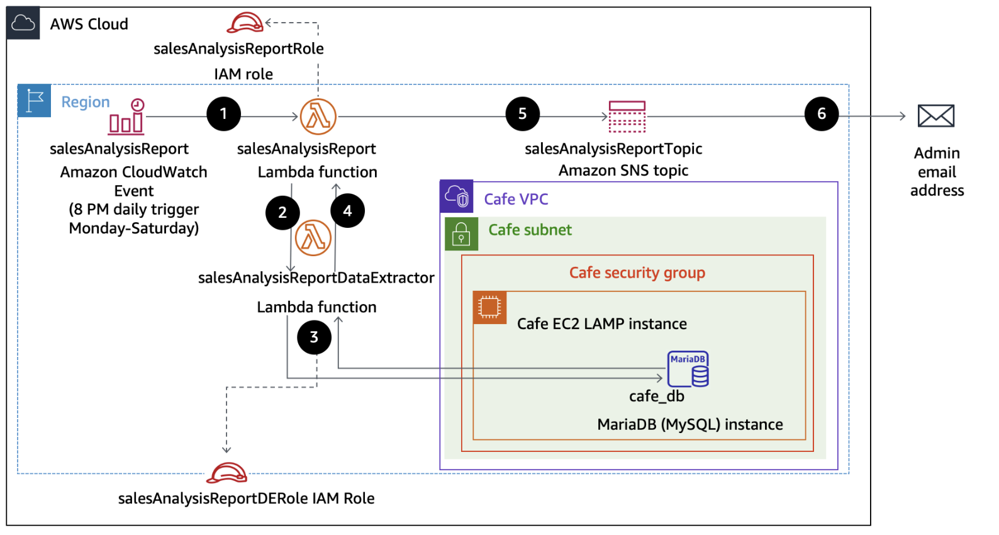

## AWS Lambda

AWS Lambda is a compute service that automatically runs your code in response to events, managing the compute resources required. This serverless model allows you to quickly deploy ideas into modern, production-ready applications, without the need to manage servers, making it an efficient solution for building and scaling applications.

AWS Lambda is a powerful, fully managed compute service that allows developers to run code in response to specific events without the need to manage servers. By handling the provisioning, scaling, and maintenance of compute resources automatically, Lambda provides a truly serverless computing model, allowing you to focus purely on the functionality of your application rather than the underlying infrastructure.

This makes Lambda particularly well-suited for building and deploying modern applications quickly and efficiently. Whether you're processing data streams, running backend logic for web and mobile applications, or triggering workflows based on changes in a data store, AWS Lambda can be configured to respond to a wide variety of events from other AWS services like S3, DynamoDB, or API Gateway.

By enabling you to write code in your preferred language and upload it to Lambda, the service automatically scales to handle varying loads, from a few requests per day to thousands per second. This scalability, combined with a pay-as-you-go pricing model where you are only charged for the compute time your code consumes, makes Lambda a cost-effective solution for production workloads. It is an ideal tool for developers looking to create resilient, scalable, and modern serverless applications.

**Steps overview**:

1. An Amazon CloudWatch Events event calls the salesAnalysisReport Lambda function at 8 PM every day Monday through Saturday.
2. The salesAnalysisReport Lambda function invokes another Lambda function, salesAnalysisReportDataExtractor, to retrieve the report data.
3. The salesAnalysisReportDataExtractor function runs an analytical query against the café database (cafe_db).
4. The query result is returned to the salesAnalysisReport function.
5. The salesAnalysisReport function formats the report into a message and publishes it to the salesAnalysisReportTopic Amazon Simple Notification Service (Amazon SNS) topic.
6. The salesAnalysisReportTopic SNS topic sends the message by email to the administrator.

**Scenario**:

1. Recognize necessary AWS Identity and Access Management (IAM) policy permissions to facilitate a Lambda function to other Amazon Web Services (AWS) resources.

2. Create a Lambda layer to satisfy an external library dependency.

3. Create Lambda functions that extract data from database, and send reports to user.

4. Deploy and test a Lambda function that is initiated based on a schedule and that invokes another function.

5. Use CloudWatch logs to troubleshoot any issues running a Lambda function.
