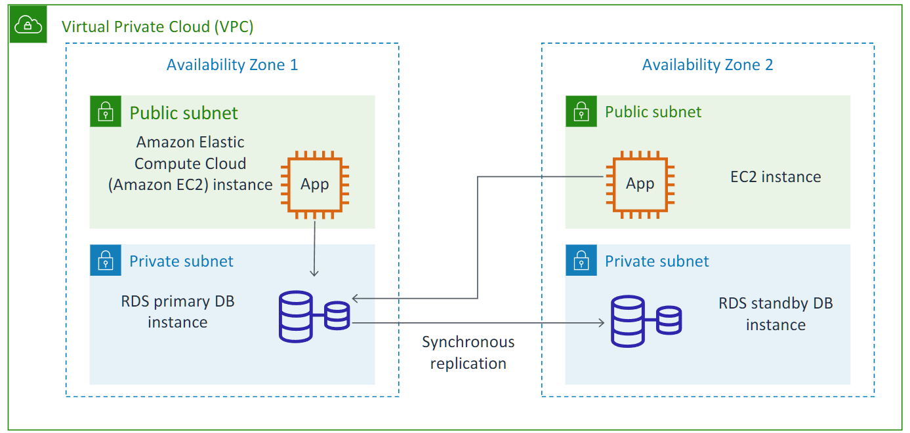
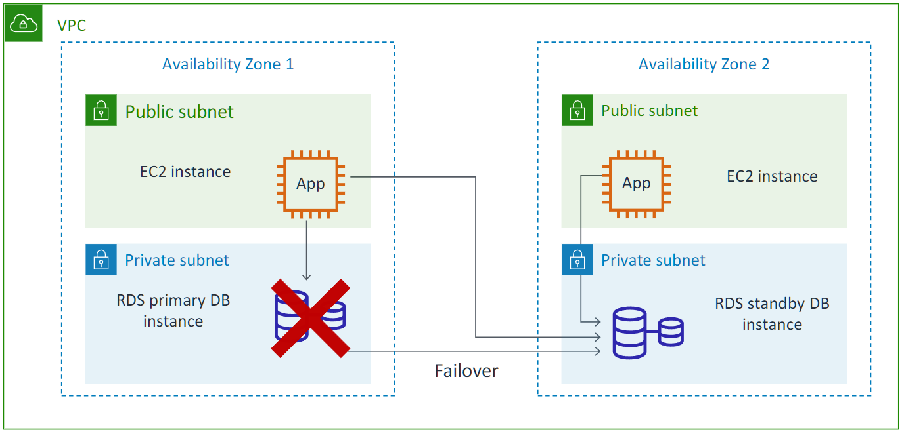
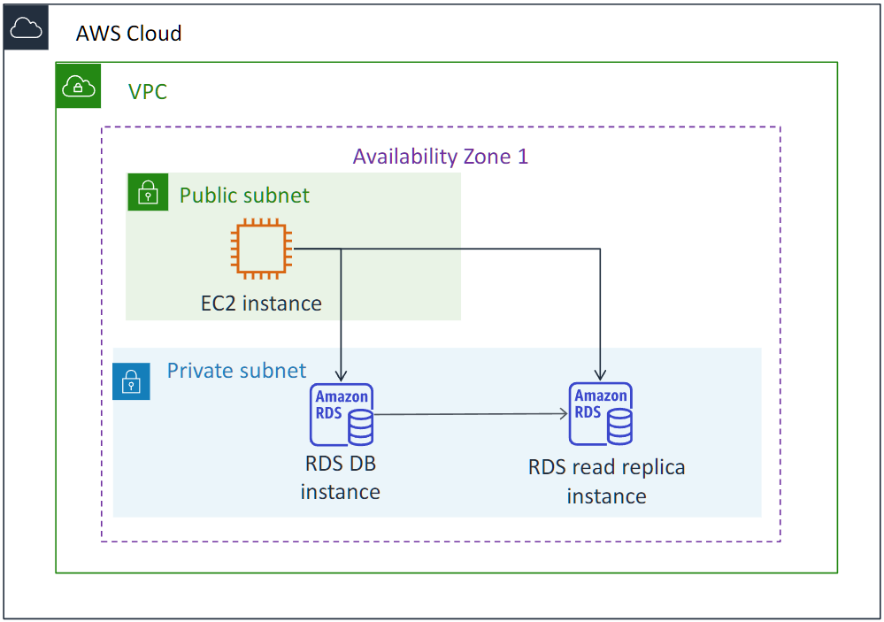

# Amazon Relational Database Service (AWS RDS)

Amazon RDS ia a managed database service that sets up and operates a relational database in the cloud.

Managing a self-hosted relational database can be both time-intensive and restrictive. To simplify this process, AWS offers a service that automates the setup, operation, and scaling of relational databases. This service, known as Amazon RDS, provides cost-effective, scalable capacity while handling routine administrative tasks.

By leveraging Amazon RDS, you can allocate more time to application development and optimization. This service ensures your applications have the necessary performance, reliability, security, and compatibility to meet your specific needs. With Amazon RDS, your primary focus remains on your data and application performance.

For web and mobile applications demanding high performance, scalable storage, and uninterrupted access, a database solution with similar characteristics is ideal. A service that offers these features without licensing restrictions aligns well with the fluctuating usage patterns of such applications.

Whether it's a small or large-scale e-commerce operation, a robust, secure, and cost-effective database solution is essential for online sales and retailing.

Mobile and online games rely on database platforms that can handle high traffic and ensure consistent availability. By automating database provisioning, scaling, and monitoring, developers can focus on game development rather than infrastructure management.

## DB Instance

A DB instance is an isolated database environment that runs in the cloud. It is the basic building block of Amazon RDS. This instance can accommodate multiple user-defined databases and is accessible through familiar tools and applications, much like a standalone database. The specific resources allocated to a DB instance, such as CPU, memory, and storage, are determined by its class and disk type.

DB instances and storage options vary in performance and cost, allowing for tailored configurations to meet specific database requirements. When creating a DB instance, you must select a compatible database engine from the supported options, which currently include:

-   MySQL
-   Aurora
-   Microsoft SQL Server
-   PostgreSQL
-   MariaDB
-   Oracle

## Amazon RDS Backup

Since Amazon RDS is a fully managed service, it handles routine database backups automatically. During a designated backup window, the entire DB instance is captured as a storage volume snapshot and retained based on a user-defined retention period. The initial snapshot is a complete copy of the data, while subsequent ones are incremental, containing only data modifications since the last capture.

For those seeking more granular control, manual snapshots can be created for individual DB instances.

To delve deeper into managing backups and snapshots within Amazon RDS, refer to the official documentation: "Backing up and restoring an Amazon RDS DB instance" at [Amazon RDS backup](https://docs.aws.amazon.com/AmazonRDS/latest/UserGuide/CHAP_CommonTasks.BackupRestore.html) .

## Easy Create method in Amazon RDS

The easiest way to create a DB instance is to use the AWS Management Console.
After you create the DB instance, you can use standard MySQL utilities—such as MySQL Workbench—to connect to a database on the DB instance. You can create a DB instance in Amazon RDS in two ways. The management console offers an Easy Create method and a Standard method. If you choose to use the Easy Create method, the configuration options are based on Amazon best practices. You can specify a DB engine and instance size and can choose an identifier. You also have an opportunity to select Standard to create your instance. You determine or choose your configurations.

**MySQL Example**:

To create a MySQL DB instance, follow these steps:

-   **Select Database Engine**: In the configuration settings, choose MySQL as the desired database engine.
-   **Complete Configuration**: Provide the necessary information to complete the configuration process, such as instance class, storage size, and security group.
-   **Create DB Instance**: Once the configuration is complete, click "Create" to initiate the instance creation process.
-   **Wait for Provisioning**: Depending on the selected instance class and storage size, the provisioning process may take up to **20 minutes**.

---

## High availability with Amazon RDS

High availability with Multi-AZ deployment: Replication

Amazon RDS offers high availability through Multi-AZ deployments. This configuration automatically creates a standby replica of the database instance in a separate Availability Zone within the same VPC. After an initial full data copy, subsequent transactions are synchronously replicated to the standby. This redundancy enhances availability during planned maintenance and protects against database failures or disruptions within a specific Availability Zone.

In a typical Multi-AZ setup, the primary instance resides in one Availability Zone and serves applications from multiple zones, while the standby replica is located in a different Availability Zone for data redundancy and synchronous replication.

### High availability with Multi-AZ deployment: Failover

In the event of a primary database instance failure, Amazon RDS seamlessly transitions the standby instance to the primary role. Applications continue to access the database using the same DNS endpoint, ensuring uninterrupted service without requiring code modifications. Thanks to synchronous replication, data integrity is maintained, preventing data loss during the failover process.

### Scalability with Amazon RDS

**Key Features:**

-   Asynchronous Replication: Data is replicated from the primary instance to the read replica asynchronously, minimizing impact on primary instance performance.
-   Promotion to Primary: In certain scenarios, a read replica can be promoted to become the primary instance, offering flexibility in database management.

**Key Functionalities:**

-   Read-Heavy Workload Optimization: By offloading read queries to read replicas, you can significantly reduce the load on the primary instance, improving its performance and scalability.
-   Enhanced Read Performance: Read replicas can be scaled horizontally to handle increasing read traffic, ensuring optimal performance for read-intensive applications.

Beyond high availability, Amazon RDS provides additional scalability options:

-   **Read Replicas (MySQL, MariaDB, PostgreSQL, Aurora)**: These are asynchronous copies of your primary database instance, allowing you to offload read-heavy workloads. Applications can be directed to the read replica for read queries, reducing pressure on the primary instance. Read replicas can even be scaled horizontally to handle massive read traffic, exceeding the capacity of a single DB instance.

**Important Note**: While read replicas can be promoted to primary, this requires manual intervention due to the asynchronous nature of replication, potentially leading to some data loss.

-   **Cross-Region Read Replicas**: Amazon RDS allows creating read replicas in a different region compared to the primary instance. This enables directing reads to a geographically closer replica, enhancing user experience by reducing latency. It can also be useful for disaster recovery (DR) purposes.

**Further Resources**:

Scaling Strategies: Explore more on scaling approaches for your RDS instance in [Scaling Your Amazon RDS Instance Vertically and Horizontally](https://aws.amazon.com/blogs/database/scaling-your-amazon-rds-instance-vertically-and-horizontally/)

Storage Options: Learn about various storage types offered for RDS DB instances in [Working with storage for Amazon RDS DB instances](https://docs.aws.amazon.com/AmazonRDS/latest/UserGuide/USER_PIOPS.StorageTypes.html)

**Amazon RDS Scaling Options**

1. **Instance Class:**
    - Change instance class to increase computation and memory capacity.
2. **Storage Capacity:**
    - Scale storage for existing instances.
    - Increase storage capacity without incurring downtime.

You can also increase the capacity of a database server by changing its instance class or storage capacity. By changing the instance class, you can increase the CPU and memory that are available to the instance. By modifying the allocated storage, you can increase storage capacity without incurring downtime.

**NOTE**: changing an instance class requires downtime.

---

# Aurora

Aurora is a high-performance relational database engine offered as part of Amazon RDS.

**Key Benefits:**

-   **Compatibility:** Aurora is compatible with MySQL and PostgreSQL, allowing for seamless migration and use of existing tools and applications.
-   **High-Performance Storage:** Aurora leverages a high-performance storage subsystem optimized for its database engine, resulting in significant performance gains.
-   **Cluster Architecture:** Aurora DB clusters consist of one or more DB instances and a shared cluster volume, which manages data efficiently across multiple instances.

**Aurora DB Cluster**

An Aurora DB cluster consists of one or more DB instances and a cluster volume that manages the data for those DB instances.

**Aurora Cluster Volume**

An Aurora cluster volume is a virtual database storage volume that spans multiple Availability Zones. Each Availability Zone has a copy of the DB cluster data.

**Contents of an Aurora DB Cluster**

An Aurora DB cluster comprises two primary types of DB instances:

1. **Primary DB Instance:**

    - The primary source of truth that handles both read and write operations.
    - Serves as the primary source of data modification.

2. **Aurora Replica:**
    - Connects to the same storage volume as the primary instance, ensuring data consistency
    - instances are read-only replicas of the primary instance.

A typical Aurora DB cluster can consist of a single primary DB instance and up to 15 Aurora replicas.

**Aurora Use Cases**

Aurora is well-suited for a variety of applications:

-   **Enterprise Applications:** Aurora can significantly reduce database costs (up to 90%) while enhancing reliability and availability compared to traditional commercial databases.
-   **Software as a Service (SaaS) Applications:** Aurora's managed database service allows SaaS companies to focus on application development without the complexities of database management.
-   **Online and Mobile Gaming:** Aurora's high throughput and massive scalability capabilities make it ideal for handling the demanding requirements of online and mobile games.
