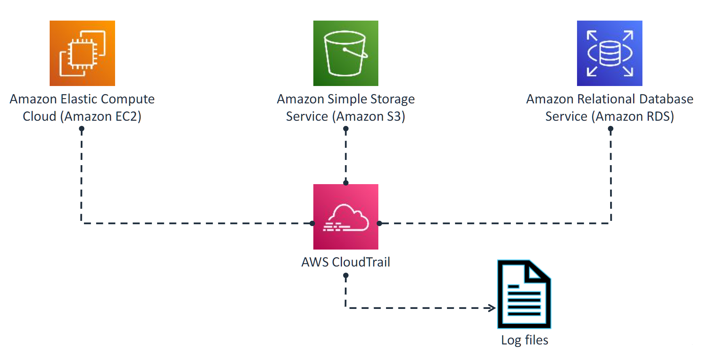
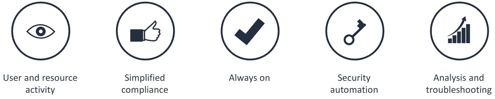
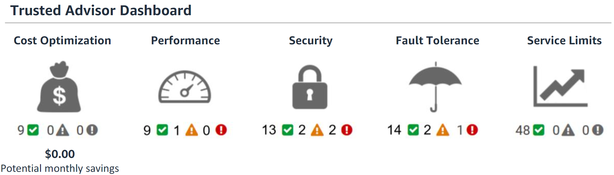
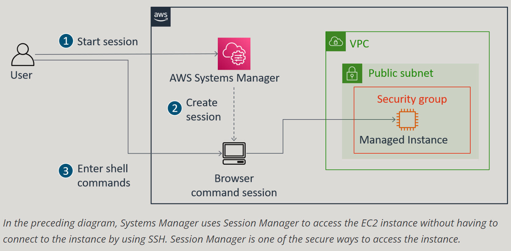

# AWS Services

## AWS Cloud Trail

CloudTrail is an auditing, compliance monitoring, and governance service provided by AWS. As part of AWS's Management and Governance tools, CloudTrail records and tracks account activity, logging API calls and actions across your AWS infrastructure. This allows you to manage data storage, perform analyses, and take remediation steps when needed. CloudTrail helps maintain visibility into user activities, which is essential for monitoring security, ensuring compliance, and troubleshooting operational issues. You can also store the logs in S3 for long-term analysis or use other AWS services like CloudWatch and Lambda for real-time monitoring and automated responses.



1. An action takes place in your AWS account.
2. CloudTrail detects and logs this action, creating what is known as a CloudTrail event. Each event contains key information, including:

-   Who initiated the request
-   The date and time when the action occurred
-   The source Internet Protocol (IP) address involved
-   How the request was made
-   Which specific actions were performed
-   Where the action took place (i.e., the AWS Region)
-   The outcome or response of the request

**CloudTrail delivers your log files to an Amazon S3 bucket that you specify**:

-   You will browse through an object hierarchy similar to the one shown below, though the bucket name, account ID, Region, and date will vary.
-   A typical log file in this hierarchy will have a name similar to:
    `123456789012_CloudTrail_us-west-1_20220209T1255ZHdkvFTXOA3Vnhbc.json.gz`
-   The object hierarchy structure might look like this:

```bash
    All Buckets
    └── Bucket_Name
          └── AWSLogs
               └── 123456789012
                    └── CloudTrail
                         └── us-west-1
                              └── 20220209
```

**NOTE**:
CloudTrail typically delivers logs within an average of about 15 minutes of an event.

**CloudTrail offers several important benefits**:



-   **Enhanced visibility**: CloudTrail provides detailed insight into user and resource activity in your AWS account, allowing you to track who performed specific actions and when they occurred.

-   **Simplified compliance audits**: Activities are automatically logged and stored, making it easier to search through logs, detect noncompliant actions, speed up incident investigations, and respond more quickly to potential issues.

-   **Operational troubleshooting**: By capturing a complete history of changes made in your account, CloudTrail helps you analyze and troubleshoot any operational problems.

-   **Security monitoring**: CloudTrail enables you to identify account changes that could increase security risks and helps streamline AWS audit requests, simplifying audits, compliance, and troubleshooting.

**CloudTrail Best Practices**:

-   **Turn on log file integrity validation**: Enabling this feature ensures the security of your log files by verifying whether they have been tampered with, deleted, or modified after being delivered to the specified S3 bucket.

-   **Aggregate log files to a single S3 bucket**: Centralize your CloudTrail logs by configuring them to be stored in a single S3 bucket. This simplifies management and enhances security, as you can define permissions for access. Use multi-factor authentication (MFA) for added protection when managing or deleting these logs.

-   **Enable CloudTrail across all AWS Regions**: Ensure that CloudTrail is turned on globally, so all settings apply consistently across both existing and newly launched Regions, ensuring comprehensive monitoring.

-   **Restrict access to CloudTrail S3 buckets**: Limit access to your S3 buckets that store CloudTrail logs to protect sensitive information. Implement strict access control and permissions for security.

-   **Integrate CloudTrail with Amazon CloudWatch**: Use Amazon CloudWatch for real-time monitoring and alerting based on CloudTrail logs. This enables automated detection and responses to potential security risks or operational issues.

These practices help ensure the security, integrity, and accessibility of your CloudTrail logs, improving your auditing and troubleshooting processes.

## Amazon Simple Notification Service (SNS)

Amazon SNS is a fully managed Pub/Sub (publish/subscribe) service for both Application-to-Application (A2A) and Application-to-Person (A2P) messaging.

Key Benefits:

-   **A2A Notifications**: Enables decoupling and integration of distributed applications by delivering application-to-application notifications.
-   **A2P Notifications**: Allows applications to send notifications directly to customers via SMS, push notifications, and email.
-   **Simplified Architecture**: Reduces complexity and costs through message filtering, batching, ordering, and deduplication.
-   **Increased Message Durability**: Enhances durability with features like message archiving, replay, delivery retries, and dead-letter queues (DLQs).

SNS provides a scalable solution to streamline communication between applications and users while maintaining efficiency and reliability.

## AWS TRUSTED ADVISOR

AWS Trusted Advisor is a tool that offers best practices and recommendations across five key categories to help optimize your AWS infrastructure. It helps to reduce cost, increase performance, and improve security by optimizing your AWS environment. These categories include:

-   **Cost Optimization**: Identifies unused or idle resources to help reduce overall AWS costs.
-   **Performance**: Offers suggestions to improve service usage and ensure your applications are operating efficiently by checking your service limits, ensuring that you take advantage of provisioned throughput, and monitoring for over-utilized instances
-   **Security**: Provides checks to enhance data protection and security compliance within your AWS environment by closing gaps, activating various AWS security features, and examining your permissions
-   **Fault Tolerance**: Enhance the availability and redundancy of your AWS application by leveraging features such as automatic scaling, health checks, deployment across multiple Availability Zones, and reliable backup options.
-   **Service Limits**: Alerts you when approaching AWS service limits. Monitor service usage that exceeds 80% of the service limit. The check’s status is displayed with color-coded indicators on the dashboard page:



**Checks have a status**:

-   ++Red(red exclamation mark)++ –Action is recommended
-   ++Yellow(yellow exclamation mark)++ –Investigation is recommended
-   ++Green(green checkmark)++ –No problem has been detected

### AWS Trusted Advisor Features

Trusted Advisor offers a variety of tools to tailor recommendations and proactively monitor your AWS resources:

-   **Trusted Advisor Notifications**: Stay informed about your AWS resources with a weekly email notification, available when you opt in.
-   **Access Management**: Control access to specific checks or entire categories.
-   **AWS Support API**: Access and refresh Trusted Advisor results programmatically.
-   **Action Links**: Easily implement recommendations by accessing report items via hyperlinks, which direct you to the AWS console.
-   **Recent Changes**: Track recent check status changes on the console dashboard, with the most recent updates shown at the top.
-   **Exclude Items**: Customize reports by excluding non-relevant items from check results.
-   **Refresh All**: Refresh individual checks or all checks simultaneously by selecting “Refresh All” on the summary dashboard. Each check is eligible for a refresh every ++five minutes++.

More details: [AWS Trusted Advisor product page](https://aws.amazon.com/premiumsupport/technology/trusted-advisor/).

### Trusted Advisor Security Checks

Trusted Advisor provides essential security checks to all AWS customers free of charge, focusing on IAM, multi-factor authentication, and other security configurations:

1. **AWS Identity and Access Management (IAM) Use**:
   Verifies the presence of at least one IAM user, encouraging best practices by discouraging root access.

2. **Multi-Factor Authentication (MFA) on Root Account**:
   Checks the root account to ensure MFA is activated for enhanced security.

3. **Security Groups – Specific Ports Unrestricted**:
   Examines security groups for rules that allow unrestricted access (0.0.0.0/0) to specified ports, helping to prevent unauthorized access.

4. **Amazon Simple Storage Service (Amazon S3) Bucket Permissions**:
   Scans Amazon S3 buckets for open access permissions or access permissions granted to any authenticated AWS user.

5. **Amazon Elastic Block Store (Amazon EBS) Public Snapshots**:
   Inspects permission settings for Amazon EBS volume snapshots, notifying if any snapshots are publicly accessible.

6. **Amazon Relational Database Service (Amazon RDS) Public Snapshots**:
   Verifies the permission settings of Amazon RDS DB snapshots and alerts if any snapshots are marked as public.

These checks, provided to all AWS customers, help promote performance and security best practices.

## AWS CONFIG

Use to define and enforce Tags...

## AWS BUDGETS

## AWS LAMBDA

## AWS IAM

## Amazon Relational Database Service (RDS)

## Amazon Inspector

Amazon Inspector is an automated vulnerability management service that continually scans workloads for software vulnerabilities and unintended network exposure. Amazon Inspector automatically discovers workloads, such as Amazon EC2 instances, containers, and Lambda functions, and scans them for software vulnerabilities and unintended network exposure.

## Systems Manager

Systems Manager is a secure end-to-end management solution for hybrid cloud environments. Systems Manager is the operations hub for your AWS applications and resources and consists of four core feature groups.

Systems Manager is a management service that helps a user perform and automate administration tasks, including the following:

-   Collect software inventory.
-   Configure Microsoft Windows and Linux operating systems.
-   Apply operating system (OS) patches.
-   Create system images.

Systems Manager automates the configuration and management of systems that run on premises and in the AWS Cloud. With Systems Manager, a user can select the instances that they want to manage and define the management tasks that they want to perform. Systems Manager also offers many capabilities and benefits that systems operations (SysOps) specialists find useful.

CLI command instead of running the Systems Manager (from lab 169):

```bash
aws ssm send-command --document-name "c133986a3397980l8151403t1w403671920753-InstallDashboardApp-7k62gkAahNse" --document-version "1" --targets '[{"Key":"InstanceIds","Values":["i-02d370234942e73c4"]}]' --parameters '{}' --timeout-seconds 600 --max-concurrency "50" --max-errors "0" --region us-west-2
```



When you use Session Manager with Microsoft Windows, Session Manager provides access to a PowerShell console on the instance.

## AWS CodeDeploy / on Developer Tools on AWS

## Amazon Relational Database Service (Amazon RDS)

Amazon Relational Database Service (Amazon RDS) is a managed service by Amazon Web Services (AWS) that simplifies the setup, operation, and scaling of relational databases in the cloud. RDS supports several popular database engines, including Amazon Aurora, PostgreSQL, MySQL, MariaDB, Oracle, and Microsoft SQL Server, allowing users to choose the best option for their specific use case.

### Key Features of Amazon RDS:

-   **Automatic Provisioning and Management**: AWS handles the infrastructure, including hardware provisioning, patching, and backups, so users can focus on building their applications.
-   **High Availability and Durability**: RDS offers automatic backups, snapshots, and multi-AZ (Availability Zone) deployments for enhanced reliability.
-   **Scalability** : It enables users to scale compute and storage resources independently with minimal downtime, adapting to application demands.
-   **Security**: Offers data encryption at rest and in transit, integrated with AWS Identity and Access Management (IAM), Virtual Private Cloud (VPC), and other security features.
-   **Monitoring and Performance Insights**: Built-in monitoring tools and performance dashboards help users track database metrics and optimize performance.

**Common Use Cases**:
Web and mobile applications requiring high-performance relational databases
Business applications needing reliable, highly available databases
Analytics applications leveraging relational data
With Amazon RDS, users benefit from the functionality of a managed relational database without needing to handle manual database management tasks.

**Multi-AZ Amazon RDS for MySQL database instance**:

Amazon RDS Multi-AZ deployments provide enhanced availability and durability for Database (DB) instances, making them a natural fit for production database workloads. When you provision a Multi-AZ DB instance, Amazon RDS automatically creates a primary DB instance and synchronously replicates the data to a standby instance in a different Availability Zone (AZ).
