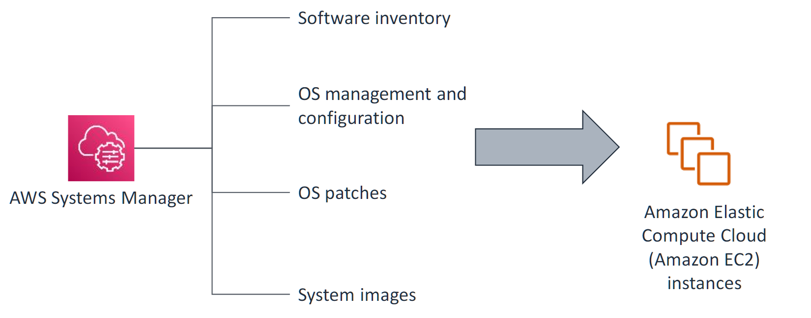

# AWS Systems Manager

AWS Systems Manager is a comprehensive service that helps you manage and automate operational tasks across your AWS infrastructure. It provides a unified interface to view and manage your AWS resources and on-premises systems, enabling better control, automation, and visibility. It is especially valuable in managing distributed environments, making it an essential tool for modern IT operations.



**Key Features**:

1. **Operational Data Aggregation**

    - Centralizes operational data from multiple AWS services.
    - Provides insights through dashboards, logs, and resource inventories.

2. **Automation**

    - Allows you to create, run, and manage automation workflows.
    - Simplifies repetitive tasks such as instance patching or configuration changes.

3. **Patch Management**

    - Automates the patching of operating systems and applications.
    - Supports compliance tracking to ensure systems are up to date.

4. **Run Command**

    - Executes remote commands on managed instances without needing SSH access.
    - Useful for ad-hoc or routine tasks like updating software or gathering system information.

5. **Session Manager**

    - Provides secure and auditable shell or PowerShell access to managed instances without the need for open inbound ports, SSH keys, or bastion hosts

6. **Inventory Management**

    - Tracks configurations and detailed inventory of your AWS and on-premises resources.
    - Helps in understanding resource utilization and compliance status.

7. **Compliance and Configuration Management**

    - Monitors and enforces desired states for resources using State Manager.
    - Integrates with AWS Config for compliance checks.

8. **Secure Parameter Storage**

    - Stores and retrieves secrets and configuration data through Parameter Store.
    - Encrypts sensitive data like database credentials or API keys.

9. **Maintenance Windows OS**

**Use Cases**:

-   **Infrastructure Automation**: Automate repetitive IT tasks, like patching, backups, and system updates.
-   **Compliance Tracking**: Ensure that resources meet organizational policies or regulatory requirements.
-   **Incident Management**: Quickly resolve operational issues using automated runbooks and diagnostics.
-   **Resource Inventory**: Maintain an up-to-date inventory of your AWS resources for better visibility.

**Supported Environments**:
AWS Systems Manager works across Amazon EC2 instances, on-premises servers, and virtual machines (VMs) by installing the Systems Manager Agent (SSM Agent).

**Benefits**:

-   Simplifies operational complexity.
-   Increases efficiency through automation.
-   Enhances security by reducing the need for manual SSH or RDP access.
-   Provides actionable insights through integrated dashboards.

---

## Capabilities overview

### 1. Documents

A Systems Manager document defines the actions that Systems Manager performs on EC2 instances you manage.

Documents are a core capability of many Systems Manager features. They define the steps and parameters of the actions that you want to perform on instances. Systems Manager document (SSM document) types include Command documents, which are used by State Manager and Run Command, and Automation runbooks, which are used by Systems Manager Automation.Documents can be authored in `JSON` or `YAML`. You can use ap redefined Systems Manager document, create your own custom document, or use a shared document.

## Ownership of Documents

### Owned by Amazon

AWS provides a collection of predefined documents for common operational tasks.

### Owned by You

You can:

-   Customize existing documents.
-   Create entirely new documents tailored to your requirements.

### Shared with You

Documents shared from another AWS account, allowing collaboration across teams or accounts.

## Document Formats

Documents can be written in:

-   **JSON**
-   **YAML**

## Key Features

### Reusability

-   Documents can be reused across multiple instances or environments, saving time and ensuring consistency.

### Customizability

-   Modify or create documents to fit your specific needs.

### Integration

-   Seamlessly integrates with other Systems Manager features like **Run Command**, **State Manager**, and **Automation**.

## Examples of Use Cases

-   Automating software installation or updates.
-   Restarting services or instances.
-   Performing system checks and diagnostics.
-   Managing patch compliance across an instance fleet.

### 2. Automation

Safely automate common and repetitive IT operations and management tasks across your resources.

It allows you to define common IT tasks as a collection of steps in an Systems Manager document (SSM document). These automation workflows can be executed across a collection of AWS resources, streamlining and standardizing operational tasks.

## Key Features

-   **Task Automation**: Automate tasks like remediating unreachable instances, creating golden Amazon Machine Images (AMIs), or patching instances.
-   **Custom Automation**: Create custom workflows in JSON to suit specific requirements.
-   **Event Integration**: Integrate with Amazon EventBridge to initiate Systems Manager automations.

## Suggested Approach to Developing and Testing Automations

### Step 1: Create or Use an Automation Document

-   Develop a custom automation document or use an existing template.
-   Define sequential steps and parameters for Systems Manager to execute.

### Step 2: Run the Automation Document

Systems Manager will execute the actions specified in the document. Example actions include:

-   Launching an instance.
-   Taking a snapshot.
-   Tagging an instance.
-   Deleting old images.
-   Terminating an EC2 instance.

### Step 3: Monitor and Validate

-   Monitor the automation workflow using the AWS Management Console.
-   After the automation completes, verify the expected outcomes.  
    For instance, launch a test instance from an AMI updated by the automation to confirm it meets the desired specifications.

By leveraging AWS Systems Manager Automation, you can simplify and standardize complex operational workflows, ensuring consistency and reducing the likelihood of human error.

### 3. Run Command

The `Systems Manager Run Command` provides an automated way to run predefined or your own commands against EC2 instances. It allows to choose instances or tags, choose controls or schedules and run commands immediately or on a specific schedule.

`Run Command` reduces management overhead because a user can manage instances without setting up `bastion hosts` or managing `Secure Shell` (`SSH`) keys and certificates. You can use it from the AWS Management Console, the AWS Command Line Interface (AWS CLI), AWS Tools for Windows PowerShell, or the AWS SDKs.

`Run Command` offers a variety of predefined commands tailored for specific operating systems:

-   **`AWS-InstallWindowsUpdates`**

    -   Scans for and installs missing updates on Windows instances.
    -   Optionally reboots the instance after installation.

-   **`AWS-RunPowerShellScript`**

    -   Executes a PowerShell script on Windows or Linux instances.

-   **`AWS-RunShellScript`**
    -   Runs a shell script on Linux or macOS instances.

### 4. Session Manager

Allows securely connecting to instances without the need to open inbound ports in the security groups, maintain bastion host instances in Amazon EC2 subnets, or manage SSH keys You can manage your EC2 instances through an interactive browser-based shell in the `AWS Management Console`. You can use also use the `AWS CLI` or `SSH` to start a session.

Session Manager supports compliance with corporate policies by providing controlled access to instances, enforcing strong security practices, and maintaining detailed audit logs of instance access.

## Key Features

-   **User Tracking**

    -   Session Manager logs the identity of every user who starts a session on a Linux or Windows EC2 instance.
    -   You can review access details, such as which users accessed specific instances and when, through AWS CloudTrail.

-   **Command Logging**

    -   Session Manager can be configured to record all commands executed on an instance.
    -   These logs can be stored in Amazon Simple Storage Service (Amazon S3) or monitored in near real-time using Amazon CloudWatch Logs.

### 5. Patch Manager

Deploy operating system and software patches automatically across large groups of EC2 instances or on-premises machines.

Patching servers and instances often involves challenges such as:

-   **Time-Consuming Processes**: Applying patches to multiple EC2 instances or on-premises machines can take significant time.
-   **Repetitive Tasks**: The manual nature of patching increases the potential for errors.
-   **Risk of Downtime**: Errors during patching can lead to service interruptions.
-   **Compliance Issues**: Ensuring all systems meet patch compliance requirements can be difficult.

## Automating Patching with Patch Manager

Patch Manager streamlines the patching process and minimizes these challenges by automating the following steps:

1. **Create a Patch Baseline**

    - Define rules that automatically approve or reject patches based on your criteria.

2. **Define a Maintenance Window**

    - Schedule patching operations and group instances together for consistent updates.

3. **Apply Patches**

    - Patches are installed within the defined maintenance window.
    - Instances in the patch group are rebooted as necessary to finalize updates.

4. **Review Compliance**
    - After patching is complete, review results and ensure patch compliance for all instances.

By automating these tasks, Patch Manager reduces operational overhead, improves reliability, and ensures compliance with patching policies.

### 6. Maintenance Windows

Maintenance Windows in AWS Systems Manager help you define schedules and automate tasks for maintaining your resources. You can use `Maintenance Windows` to define a schedule for when to perform potentially disruptive actions on your instances. For example, these actions can include patching an operating system, updating drivers, or installing software or patches. The scheduled actions are run automatically, and the user can set limits for simultaneous task runs and allowable error rates.

Steps to Implement a Maintenance Window

1. **Create a Maintenance Window**

    - Define basic settings such as:
        - Name
        - Schedule (e.g., daily, weekly)
        - Duration (how long the maintenance window remains open)

2. **Assign Targets**

    - Specify the resources (e.g., EC2 instances, on-premises servers) that the maintenance tasks will apply to.

3. **Assign Tasks**

    - Define the tasks to run on the selected targets. Common task types include:
        - **Run Command**: Execute predefined or custom commands via Systems Manager.
        - **Automation Workflows**: Use Systems Manager Automation to perform complex workflows.
        - **Step Functions Workflows**: Integrate with AWS Step Functions for orchestrating tasks.
        - **Lambda Functions**: Invoke AWS Lambda functions to execute custom logic.

4. **Review Task Status**
    - After the tasks have been completed, review their status to ensure successful execution and identify any issues.

### 7. AWS Systems Manager State Manager

State Manager is a secure and scalable configuration management service that ensures your Amazon EC2 and hybrid infrastructure maintain a defined configuration. It helps prevent configuration drift and monitors whether instances are in their intended state.

## How State Manager Works

1. **Choose or Create an Systems Manager document (SSM document)**

    - Select an existing SSM document or create one to define the actions State Manager will perform.
    - The document specifies the desired configuration state for your instances.

2. **Associate Instances with the Document**

    - Identify individual instances or groups of instances to target.
    - The association applies the defined state from the document to the specified instances.

3. **Define the Schedule**

    - When creating the association, set a schedule to determine how frequently the desired state is applied to the instances.
    - This ensures the configuration remains consistent over time.

4. **Write Command Output to S3 (Optional)**
    - You can configure the association to store the output of commands in an Amazon S3 bucket for tracking and auditing purposes.

### 8. AWS Systems Manager Parameter Store

Parameter Store provides a secure, scalable solution for managing configuration data and secrets. It stores values as name-value pairs and allows for both plain text and encrypted data storage.

## Key Features

-   **Hierarchical Storage**

    -   Organize data using a hierarchical structure, making it easier to manage and retrieve configurations.

-   **Configuration Data and Secrets Management**

    -   Store critical data such as passwords, database connection strings, and AMI IDs.

-   **Parameter Values**

    -   Data is stored as name-value pairs, allowing you to store different types of values and reference them in your scripts, commands, SSM documents, or workflows.

-   **Encryption with AWS KMS**
    -   When securing parameter values, AWS Key Management Service (AWS KMS) is used to encrypt the data, ensuring sensitive information is protected.

By using Parameter Store, you can securely manage configuration settings and secrets across your infrastructure, integrating them seamlessly into your automation and configuration workflows.

**Example:**
The following steps demonstrate how to securely store and retrieve a sensitive parameter, such as a database password, using AWS Systems Manager Parameter Store:

## Step 1: Create a Parameter in Parameter Store

-   You create a new parameter to store the database password.
-   The parameter is given a **hierarchical path name**: `/Dev/DB/Password`, indicating it is related to the development environment.
-   You specify that the data is **sensitive** and must be **encrypted**.

## Step 2: Parameter Store Encryption

-   Parameter Store uses **AWS Key Management Service (AWS KMS)** to encrypt the parameter value.
-   The encrypted value, such as `DE24xd0w`, is stored securely in Parameter Store.

## Step 3: Retrieve the Parameter Using AWS CLI

-   When you need to retrieve the password, you can use the AWS CLI with the following command:

```bash
    aws ssm get-parameter --name /Dev/DB/Password --with-decryption
```

The `--with-decryption` option ensures that the value returned is the decrypted password, allowing you to securely access the sensitive information.

### 9. Inventory

# AWS Systems Manager Inventory

The `Systems Manager Inventory` feature allows you to gather detailed information about your EC2 instances and the software installed on them. The inventory can include various data points such as:

-   Application data
-   Files
-   Network configurations
-   Windows services
-   Server roles
-   Updates
-   System properties

By collecting this data, `Systems Manager Inventory` provides insights into the configurations and applications across multiple instances. This eliminates the need to log into each instance individually. The collected information can be used for managing application assets, tracking licenses, monitoring file integrity, discovering untracked applications, and more.

Systems Manager Inventory simplifies the process of system and application management at scale, offering a centralized view of your infrastructure's state.
