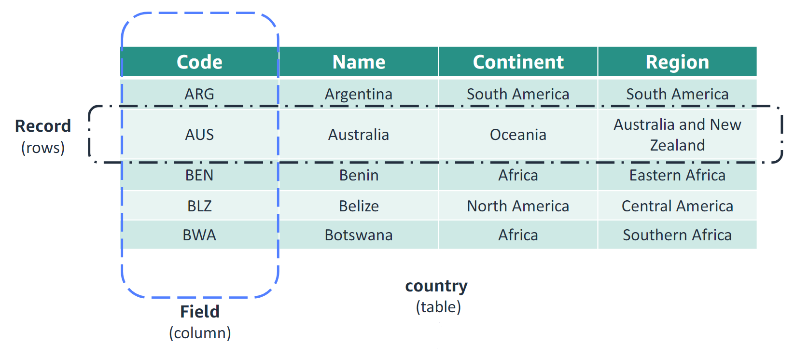
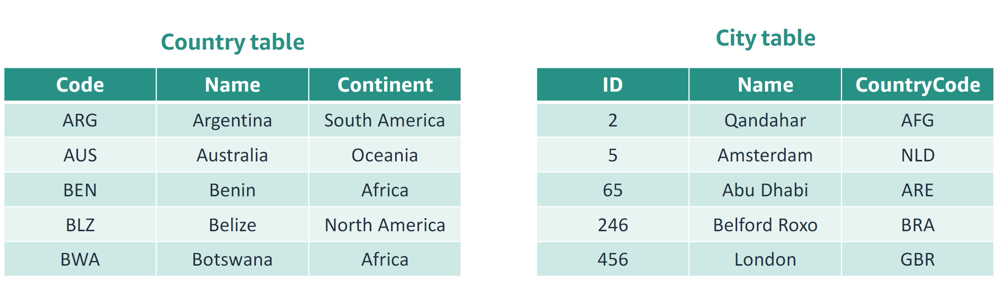
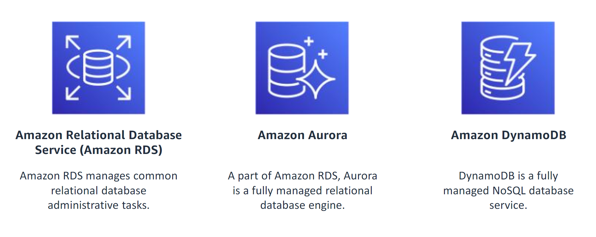

# Introduction to Databases

## What is a Database?

A **database** is a collection of organized data stored in files known as **tables**.

-   **Tables** provide a logical structure for accessing, managing, and updating data.

## Data Models

### What is a Data Model?

A **data model** represents the logical structure and design of the data stored in a database. Data models are essential for determining how data can be stored, organized, and accessed within the database.

### Types of Data Models

Examples of data models include:

-   **Relational**: Organizes data in structured tables with rows and columns.
-   **Semi-structured**: Stores data without a fixed schema, often using formats like JSON or XML.
-   **Entity Relationship (ER)**: Represents data as entities and relationships between them.
-   **Object-based**: Uses objects, as in object-oriented programming, to represent data.

## The Relational Model



The **relational model** is a foundational data model developed by Dr. Edgar F. Codd, a mathematician at IBM, in the late 1960s. Designed to improve the management of large datasets, the relational model is based on **relational algebra**, a branch of mathematics. This model introduced a structured approach to storing and accessing data, making it easier to retrieve and manipulate information.

### How the Relational Model Works

In the relational model, data is stored in structures called **tables**. Each table holds information about a specific set of objects or entities within the database. For example, in a database named **World**, we might have a table named **country**.

-   **Table**: Represents a collection of data, organized into **rows** (records) and **columns** (fields).
-   **Row (Record)**: Each row in a table represents a single instance of the entity described by the table. In the `country` table, each row might represent a unique country, including details like its code, name, continent, and region.
-   **Column (Field)**: Each column holds a specific attribute of the entity, such as a country’s name or region. Columns define the types of data each row contains.

In this example, the `country` table includes the following fields:

-   `country_code`: Unique identifier for each country
-   `country_name`: The name of the country
-   `continent_name`: The continent the country is part of
-   `region_name`: The region the country belongs to

Each row, then, is a unique record for a country, combining values for each of these columns to describe a specific instance.

### Relational Databases in Modern Applications

Relational databases are the backbone of many data-driven applications, websites, and mobile apps. By organizing data in structured tables, relational databases enable efficient data retrieval, consistency, and integrity, especially when working with complex or interconnected data across various applications and platforms.

## Database Schema

A **database schema** defines the organization and structure of data within a database, based on the database’s data model. It serves as a blueprint for how data is organized and specifies the structure and constraints of the data within the database.

### Key Components of a Database Schema

A schema outlines several critical elements:

-   **Tables**: Represent objects within the data model. For example, in a database named **World**, the tables `country` and `city` might store information about countries and cities respectively.

-   **Columns**: Define the attributes of objects within each table. In the `country` table, columns might include `Code`, `Name`, `Continent`, and `Region`, each storing a specific attribute of a country.

-   **Relationships**: Define how tables are related to one another. For instance, a `city` is associated with a `country`. This relationship is represented by the `CountryCode` column in the `city` table, which holds the code for the country where the city is located.

-   **Constraints**: Establish rules and conditions for data integrity within the schema. For example, a `CountryCode` value in the `city` table must have a corresponding `Code` value in the `country` table, ensuring that each city entry references a valid country.

### Example: World Database Schema

Below is a simplified view of a schema for the **World** database:

#### Table: `country`

| Column      | Description                   |
| ----------- | ----------------------------- |
| `Code`      | Unique identifier for country |
| `Name`      | Name of the country           |
| `Continent` | Continent of the country      |
| `Region`    | Region within the continent   |

#### Table: `city`

| Column        | Description                        |
| ------------- | ---------------------------------- |
| `ID`          | Unique identifier for city         |
| `Name`        | Name of the city                   |
| `CountryCode` | Code of the country (foreign key)  |
| `District`    | District where the city is located |

A schema like this provides a clear and structured organization of data within a database, ensuring consistency, relationships, and integrity across tables and attributes.

## What is a Relational Database?

A **relational database** is a structured collection of data items organized in tables, where predefined relationships exist between the data. Relational databases are often referred to as **SQL databases** due to their reliance on Structured Query Language (SQL) for data manipulation and querying.

### Key Characteristics of a Relational Database

-   **Fixed Structure**: Relational databases require a predefined schema or structure, which defines the organization of data and its relationships.

-   **Table-Based Data Storage**: Data is stored in tables consisting of **rows** and **columns**.

-   **Data Relationships**: Each table holds information about specific objects, with relationships established between tables to reflect logical connections in the data.

-   **Data Access & Queries**: Data is accessed and managed through SQL queries, following the schema’s definitions.

### Example: Relational Database Design

-   **Tables**: Used to represent different entities. For instance, in a company database, `employees` and `departments` might be separate tables.

-   **Rows and Columns**: Data for each entity is spread across rows (records) and columns (attributes). Each row contains data for a specific instance, like an individual employee, while columns hold attributes like `EmployeeID`, `Name`, and `DepartmentID`.

-   **Database Schema**: The schema outlines how tables relate, such as defining that each employee’s `DepartmentID` connects to a record in the `departments` table.

Relational databases are widely used for applications requiring structured data storage and robust querying, making them ideal for business applications, web apps, and data management systems.

## Main Reasons to Use a Relational Database

Relational databases are a popular choice for data storage due to their robust features and ease of use, especially in applications where data integrity, consistency, and structured queries are essential.

### Key Benefits of Relational Databases

-   **SQL Support**: Relational databases natively support SQL (Structured Query Language), making it easy to query and manipulate data. SQL is widely known, relatively simple to learn, and efficient for data access.

-   **Data Integrity**: Built-in data integrity ensures accuracy and consistency. For instance, columns in a table are defined with specific data types, preventing data entry errors, such as trying to store text in a column designed for numbers.

-   **Transactional Support**: Relational databases support transactions, which enable multiple operations to be executed as a single unit. This guarantees that either all operations succeed or none are applied, preserving data integrity and consistency.

### Common Use Cases

-   **Ecommerce**: Handling orders, product listings, inventory, and customer data.
-   **Customer Relationship Management (CRM)**: Managing customer interactions and maintaining accurate customer records.
-   **Business Intelligence (BI) Tools**: Supporting finance reporting, data analysis, and complex queries for informed decision-making.

### Examples of Relational Databases

-   **MySQL**
-   **Amazon Aurora**
-   **PostgreSQL**
-   **Microsoft SQL Server**
-   **Oracle**

Relational databases remain popular due to their structured approach, data integrity features, and the versatility provided by SQL, making them essential for various applications requiring reliable data storage and retrieval.



## Tables in Relational Databases

In relational databases, **tables** are used to store information about objects represented within the database. Each table is organized in **columns** and **rows**:

-   **Columns** (or fields) store a specific type of data, such as numbers, strings, or dates.
-   **Rows** represent a collection of values for each column, effectively creating a complete set of information for one entity or object.

### Primary and Foreign Keys

-   Each row in a table can have a unique identifier, known as a **primary key**. This key uniquely identifies each record.
-   To link related records between tables, a **foreign key** is used. This field refers to the primary key in another table, establishing a relationship between the two tables.

### Example: Country and City Tables

Consider two tables: `country` and `city`. Here’s how each element functions:

-   **Columns**: In the `country` table, the `Name` column holds text data, such as "Argentina" or "Belize."
-   **Rows**: Each row represents one record of an object. In the `city` table, a row with `ID` of 2 might represent the city of "Qandahar," with columns for `Name` (Qandahar) and `CountryCode` (AFG).

### Relating Tables

These tables can be related through a **common field**, such as `CountryCode`. By using primary and foreign keys, `CountryCode` in the `city` table can reference the primary key in the `country` table, establishing a connection between the city and its associated country.

This structure allows relational databases to efficiently organize and link data across multiple tables, enhancing data consistency and enabling complex queries.

<br>

## The Nonrelational Model

## What is a Nonrelational Database?

A **nonrelational database** is a type of database that does not follow the traditional relational model:

-   It does **not require a fixed structure** for data, allowing for flexibility in the organization and storage of information.
-   Unlike relational databases, a nonrelational database **does not use a table-based structure**.

Nonrelational databases are commonly referred to as **NoSQL databases**. The term "NoSQL" stands for "Not only SQL," indicating that other query languages, aside from SQL, can be used to access and manage data in these databases.

This flexibility makes nonrelational databases particularly well-suited for handling large amounts of unstructured or semi-structured data, such as documents, key-value pairs, graph structures, and wide-column data stores.

## Use Cases for Nonrelational Databases

Nonrelational databases are optimized for applications requiring large data volumes, low latency, and flexible data models. Common use cases include:

-   **Fraud detection**
-   **Internet of Things (IoT)**
-   **Social networks**

### Examples of NoSQL Databases

Popular nonrelational databases include:

-   **Amazon DynamoDB**
-   **MongoDB**
-   **Apache HBase**

### Data Storage in NoSQL Databases

Unlike relational databases, which divide objects into multiple tables (e.g., customers, orders) using a fixed schema, nonrelational databases use flexible schemas or store data as documents, often in **JSON** or **XML** formats.

#### Example JSON Document

Nonrelational databases can store data as JSON, such as:

```json
[
    {
        "ID": 1024,
        "Name": "Mumbai (Bombay)",
        "CountryCode": "IND",
        "District": "Maharashtra",
        "Population": "10500000"
    }
]
```

<br>

## A Database Management System (DBMS)

## DBMS Basics (1 of 2)

### What is a DBMS?

A **Database Management System (DBMS)** is software, or a **Database as a Service (DBaaS)**, that provides essential database functionality.

#### Primary Functions of a DBMS:

-   **Creating databases** for structured data storage
-   **Inserting data** into the database
-   **Storing, retrieving, updating, or deleting data** as needed

The main benefit of using a DBaaS is the ability to avoid the costs and overhead associated with installing and maintaining servers.

#### Variations of DBMS:

1. **Single-user DBMS applications** – Examples include **Microsoft Access**.
2. **Multiple-user DBMS applications** – Examples include **Oracle Database**, **Microsoft SQL Server**, **MySQL**, and **IBM Db2**.

#### How does a DBMS help store and manage data?

A **DBMS** is essential for managing and interacting with data in a structured way. If you choose a **DBaaS**, the provider handles the infrastructure, letting you focus on designing, creating, and maintaining your database without worrying about server maintenance.

## DBaaS

### A Few Key Points About Cloud-Based Databases

-   **Hosted by Third-Party Providers**:  
    These database servers are hosted in third-party data centers and accessed over the internet (the cloud) instead of being hosted on local networks.

-   **Reduced Cost**:  
    These databases reduce the cost of installing and maintaining servers.

-   **Fully Managed**:  
    For example, with managed AWS databases, you don’t need to manage database management tasks, such as server provisioning, patching, setup, configuration, backups, or recovery.

-   **Faster**:  
    With these databases, you can leverage companies like AWS that offer large amounts of storage and processing power in their data centers.

With **DBaaS**, database servers are hosted in third-party data centers and accessed over the internet (the cloud) instead of being hosted on local networks.



## Key Takeaways

-   A **relational database**, often referred to as a **SQL database**, allows data to be spread across multiple tables.

-   A **nonrelational database**, commonly known as a **NoSQL database**, does not use a table structure to store data.

-   A **DBMS** (Database Management System) is software that provides database functionality.
