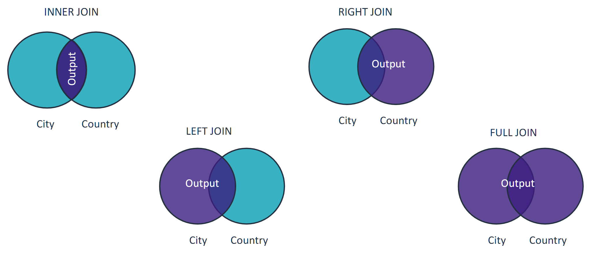

# Retrieving Data from Multiple Tables

## Set Operators

Before diving into retrieving data using `JOIN`, it’s important to understand set operators. Set operators combine the results of multiple queries into a single result set. They allow you to compare or unite results from different tables.

### Common Set Operators

| Set Operator  | Description                                                                          |
| ------------- | ------------------------------------------------------------------------------------ |
| **UNION**     | Combines two or more result sets into a single set (removing duplicates).            |
| **UNION ALL** | Combines two or more result sets into a single set (including duplicates).           |
| **INTERSECT** | Returns only the data that is common to both result sets.                            |
| **MINUS**     | Returns data from the first result set that is not present in the second result set. |

## Using the `UNION` Operator

The `UNION` operator combines the results of two or more `SELECT` queries into a single result set, automatically removing duplicates. If you want to retain duplicates, use `UNION ALL`.

### Syntax

```sql
SELECT column1, column2, ...
FROM table1
UNION
SELECT column1, column2, ...
FROM table2;
```

### Requirements

Each `SELECT` query must meet the following criteria:

-   The same number of columns.
-   Compatible data types for corresponding columns.
-   Similar column order.

### Example: `UNION` Operator

This query returns all distinct country and city names in the database:

```sql
SELECT Name FROM country
UNION
SELECT Name FROM city;
```

### Example: `UNION ALL` Operator

This query returns all country and city names, including duplicates. For instance, if both a city and a country named Armenia exist, they will appear twice in the result set:

```sql
SELECT Name FROM city
UNION ALL
SELECT Name FROM country;
```

### Key Points

-   The `UNION` operator combines the results of two or more `SELECT` statements into a single result set.
-   `UNION` removes duplicate rows by default, while `UNION ALL` retains all rows, including duplicates.

## Using the `JOIN` Operator

`JOIN` combines rows from two or more tables based on a related column. The most common types of `JOIN`s are `INNER JOIN`, `LEFT JOIN`, `RIGHT JOIN`, and `FULL JOIN`.

### Example: `INNER JOIN`

To retrieve employee names with their corresponding department names from the `employees` and `departments` tables, where `department_id` is the common column, you could write:

```sql
SELECT employees.name, departments.department_name
FROM employees
INNER JOIN departments ON employees.department_id = departments.department_id;
```

This query returns rows only where there is a matching `department_id` in both tables.

## Types of JOIN Clauses

1. **INNER JOIN**

    - Returns rows that match in both tables.

2. **LEFT JOIN**

    - Returns all rows from the left table and the matching rows from the right table. If no match exists, NULL values are returned for the right table.

3. **RIGHT JOIN**

    - Returns all rows from the right table and the matching rows from the left table. If no match exists, NULL values are returned for the left table.

4. **FULL JOIN**
    - Returns all rows from both tables. If no match exists, NULL values are returned where there are no matches.

### Summary of JOIN Clauses

-   **Inner Joins**: Only the matching rows from both tables are returned.
-   **Left Joins**: All rows from the left table are returned, along with matching rows from the right table (unmatched rows from the right contain NULL).
-   **Right Joins**: All rows from the right table are returned, along with matching rows from the left table (unmatched rows from the left contain NULL).
-   **Full Joins**: All rows from both tables are returned, with NULLs where there are no matches.

### Important Note

Each table must have related columns when using JOIN clauses to combine data.



## Qualified Column Names in SQL

Qualified column names specify the source of a column in a query, especially when multiple tables are involved. This practice avoids ambiguity and ensures the correct column is referenced.

### What is a Qualified Column Name?

A qualified column name consists of:

1. **Table Name (or Table Alias)**: The name of the table from which the column is selected.
2. **Column Name**: The name of the column within that table.

The general format is:

```
table_name.column_name
```

or, if using a table alias:

```
table_alias.column_name
```

### Example of Qualified Column Names

Given two tables, `employees` and `departments`, both containing a column named `name`, you can avoid confusion by using qualified column names:

```sql
SELECT employees.name AS employee_name, departments.name AS department_name
FROM employees
JOIN departments ON employees.department_id = departments.id;
```

In this example:

-   `employees.name` refers to the `name` column in the `employees` table.
-   `departments.name` refers to the `name` column in the `departments` table.

### Benefits of Using Qualified Column Names

-   **Clarity**: Makes SQL queries clearer, especially when dealing with multiple tables that have similarly named columns.
-   **Avoids Ambiguity**: Prevents errors from using the same column name across different tables.
-   **Improves Readability**: Enhances the readability of complex queries by clearly indicating the source of each column.

## Conclusion

Using qualified column names is a best practice in SQL, particularly in queries involving multiple tables. It helps maintain clarity and prevents errors, ensuring that the intended data is accurately selected and displayed.
