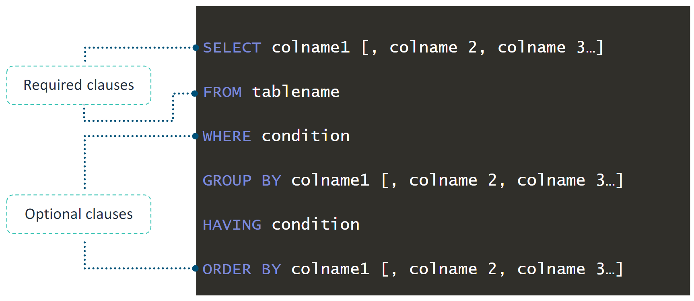

# Selecting Data from a Database

When selecting data from a database, you use the `SELECT` statement. You use the `SELECT` statement to select one or more columns from a table. You can also use the `SELECT` statement when you want to access a subset of rows, columns, or both. When you query tables, you must include the `FROM` clause in your syntax. The result of the `SELECT` statement is called a result set. It lists rows that contain the same number of columns. As you read from left to right, the statement begins with `SELECT`. Next, you see which columns should be returned and from which table. The `FROM` clause follows immediately after the `SELECT` portion.

```sql
SELECT id, name, countrycode FROM city;
```

It is important to remember that the query is processed out of order. The query will pull all of the data from the specified table and then work through each of the clauses as the example shows.

```sql
SELECT id, name, countrycode
FROM city
WHERE countrycode ='BRA';
```

Here’s how the operations in your query proceed step-by-step:

1.  `FROM`: SQL first identifies the data source—in this case, the city table. It processes all rows in this table.

2.  `WHERE`: SQL then applies any filtering conditions, as specified in the WHERE clause. Only rows where countrycode = 'BRA' are retained, and all other rows are discarded.

3.  `SELECT`: Finally, SQL projects the specified columns (here, id, name, and countrycode) from the filtered data. All other columns are ignored, keeping only the ones specified.

## SELECT statement syntax structure



**Considerations**:

-   Enclose literal strings, text, and literal dates with single quotation marks (' ').
-   As a best practice to improve readability, capitalize SQL keywords (for example,`SELECT`, `FROM`, and `WHERE`).
-   Depending on the database engine or configuration,data values that you provide in conditions might be case sensitive (i.e MySQL is not case sensitive, but Oracle is.)

### Different ways to SELECT columns

1. Single Column Selection:

```sql
Copy code
SELECT colname1 FROM table_name;
```

2. Multiple Column Selection:
   NOTE: Square brackets ([ ]) indicate that including additional columns is optional.

```sql
SELECT colname1, colname2, colname3 FROM table_name;
```

3. All Columns Selection:
   NOTE: The asterisk (\*) acts as a wildcard to retrieve all columns from the table.

```sql
Copy code
SELECT * FROM table_name;
```

### Optional clauses

The `SELECT` statement can include optional clauses to refine and control the results. These optional clauses include:

-   `WHERE` filters records based on specified conditions.
-   `GROUP BY` groups records with identical values in specified columns.
-   `HAVING` filters groups based on specified conditions, used with GROUP BY.
-   `ORDER BY` sorts the result set by one or more columns.

### Examples:

Get all the data from the `city` table, and ignore all rows except for the rows **WHERE** the `countrycode` is **BRA** (Brazil). After locating the desired rows, return only the `id`, `name`, and `countrycode` columns:

```sql
SELECT id, name, countrycode
FROM city
WHERE countrycode ='BRA';
```

Get all the rows form the `country` table, group them by `continent` and **COUNT** the number of countries in each group:
NOTE that the `GROUP BY` clause typically requires an aggregate function in the `SELECT` clause. In this case, the `COUNT()` aggregate function is used to count the number of rows in a table:

```sql
SELECT continent, COUNT(*) AS country_count
FROM country
GROUP BY continent;
```

Get a list of continents from `country` table that have more than one `country` associated with them:
NOTE that the `HAVING` clause filters the results of a GROUP BYclause in a `SELECT` statement.

```sql
SELECT continent, COUNT(*)
FROM country
GROUP BY continent
HAVING COUNT(*) > 1;
```

Get all the data from the `city` table, and order all rows by `id`. After you find the rows that you are searching for, return only the `id`, `name`, and `countrycode` columns
NOTE that Use the `ORDER BY` clause to sort query results by one or more columns and in ascending or descending order.

```sql
SELECT id, name, countrycode
FROM city
ORDER BY id;
```

## Comments Syntax in SQL

**Inline Comment** and **Single-Line Comment**:

-   This type of comment begins with a double dash (`--`).
-   Any text between the double dash and the end of the line will be ignored and not executed.

```sql
-- Display the table structure
DESCRIBE city;

SELECT name, countrycode -- not ID
FROM city WHERE countrycode = 'CHN';
```

**Multiple-line Comment**:
This type of comment begins with /_ and ends with _/.
Any text between the /_ and _/ will be ignored.

```sql
/*
SELECT id, name, countrycode
FROM city
WHERE countrycode = 'MEX';
*/
```
