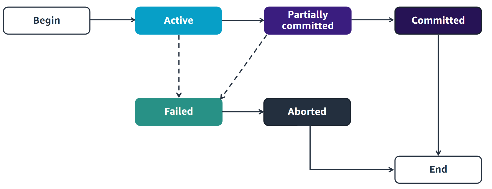

# Database interaction

## Database roles

## Roles in Database Interaction

People have different roles and ways of interacting with a database:

-   **Application Developer**  
    Creates applications that populate and manipulate the data within a database according to the application's functional requirements.

-   **End User**  
    Uses reports generated from the information stored in the database.

-   **Data Analyst**  
    Collects, cleans, and interprets data within a database system.

-   **Database Administrator**  
    Designs, implements, administers, and monitors data in database systems, ensuring consistency, quality, and security of the database.

This slide lists the roles of individuals who commonly interact with a database. Each role has different ways of engaging with the database. Direct interaction often requires the user to know how to issue a Structured Query Language (SQL) command within a specific Database Management System (DBMS). Therefore, roles with less knowledge of SQL may interact with the database using alternative methods.

A database is typically accessed through an application that an application developer creates. The developer embeds the SQL statements needed to interact with the database in the application’s code. Therefore, end users can query and update the data in the context of a business task without having to know SQL.If the end user has a little SQL knowledge, they might occasionally access the database directly, typically to perform read-only queries.

Data analysts and database administrators also interact with databases. Individuals in these roles have a greater level of expertise than a typical end user. Data analysts and database administrators would be able to create and run a SQL command.

## Data interaction models

## Types of Database Interaction

## Client-Server Interaction Model

This model involves a client application requesting data from a server, which hosts the database. The client and server communicate over a network, allowing users to access and manipulate data.

1. Users utilize computers and devices that run client applications, which use SQL to request data.
2. The applications send SQL queries to the server over a network to communicate with the database.
3. The server runs a database management system (DBMS) that receives the requests, processes the SQL, and returns the response.

## Three-Tier Web Application Interaction

In this model, there are three layers: the presentation layer (user interface), the application layer (business logic), and the data layer (database). This separation enhances scalability and maintainability, allowing for better interaction with the database.

1. The user uses a client computer or device that runs a web browser. A webpage captures the user’s input and sends a request to the web server.
2. The web server gathers the information from the webpage and forwards the request to the application server for processing.
3. A web application component running on the application server receives the request. It contains the SQL commands necessary to access the database to fulfill the request, which it then sends to the database server.
4. The database management system (DBMS) on the database server receives and processes the SQL commands. The DBMS returns the results to the application server.
5. The web application component on the application server processes the results and returns them to the web server.
6. The web server formats the results into a webpage.
7. The web browser on the client device displays the webpage containing the SQL results to the user.

 

## Transactions in databases

-   A **transaction** is a collection of changes made to a database that must be performed as a unit.
-   For example, consider an account table that keeps track of bank account balances for customers. If a customer wants to transfer $100 from their checking account to their savings account, the following operations must occur:
    -   Reduce the balance of the checking account row by $100.
    -   Increase the balance of the savings account row by $100.

Both operations must either succeed or fail together to preserve the integrity of the database. You cannot have one change succeed while the other fails.

### Key Points

-   A transaction is not successful unless each of its operations is successful.
-   It is also referred to as a **logical unit of work**. This means that either all operations succeed, resulting in a successful transaction, or if one or more operations fail, the entire transaction fails.
-   At the database level, all changes related to the transaction are either performed, or no changes are made at all. It’s an all-or-nothing modification.

## Transaction States

The status of a transaction can change as it progresses from beginning to end. The possible statuses are as follows:

-   **Active State**: In the initial state of every transaction, when the transaction is being run, its status is active.

-   **Partially Committed**: A transaction is in a partially committed state when it is completing its final operation.

-   **Failed State**: A transaction enters a failed state when any checks made by the database recovery system fail.

-   **Aborted State**: An aborted transaction occurs if the transaction is in a failed state, and the database rolls back to its original state before the transaction was executed.

-   **Committed State**: When all operations within a transaction have been successfully performed, the transaction is considered committed.

## Benefits of Using Transactions

You can use transactions to achieve the following:

-   **Ensure Atomicity**: Run a set of operations so that the database never contains the result of partial operations.

    -   If one operation fails, the database is restored to its original state.
    -   If no errors occur, the full set of statements successfully changes the database.

-   **Provide Isolation**: Ensure that programs accessing the database simultaneously do so without interference.
    -   Without proper isolation, the outcomes of concurrent requests could prove to be incorrect.

Without transactions, if two or more requests attempt to change the same data in a database simultaneously, the order and effect of those changes become unpredictable. As a result, the database may end up in a corrupted state. Transactions provide a mechanism called isolation, which ensures that simultaneous change requests are processed one at a time, preventing interference between them.

## ACID properties of transactions in DBMS

Transactions follow four standard properties—**atomicity**, **consistency**, **isolation**, and **durability**—which are known as **ACID**:

-   **Atomicity**: Ensures that changes are successfully completed all at once or not at all.
-   **Consistency**: Guarantees that any changes will not violate the integrity of the database, including any constraints.
-   **Isolation**: Keeps all transactions isolated so that they do not interfere with each other.
-   **Durability**: Ensures that as soon as a transaction is committed, the change is permanent.

### Key Takeaways

-   The roles that interact with a database include the **database administrator**, **application developer**, **data analyst**, and **end user**.
-   An **end user** typically accesses a database through a **client-server application** or a **three-tier web application**.
-   A **database transaction** is a collection of database changes that must be performed as a unit.
-   Transactions follow four standard properties, known as **ACID**.
