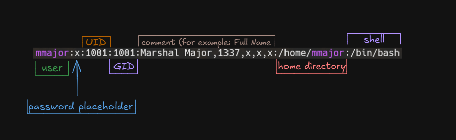
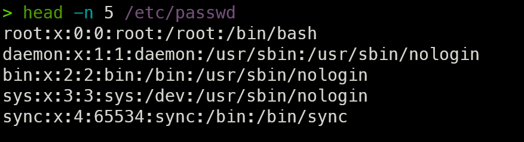
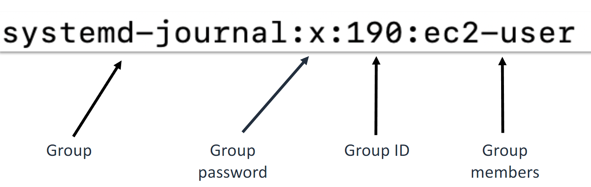

# Linux Fundamentals

## Users and Groups

### 1. User Accounts

-   User accounts represent individual users on the Linux operating system.
-   Information about user accounts can be stored either locally or on another server.
-   Locally, this information is stored in the /etc/passwd file.
-   As a best practice, it is recommended to assign one user per user account and to avoid sharing accounts.

**The `tail` command**

The command `sudo tail /etc/passwd` will display the last 10 lines of the passwd file by default. You can adjust the number of lines shown by using the -n option followed by your desired number. For example, to display the last 5 lines:

```sh
tail -n 5 /etc/passwd
```

In this case, the file being displayed is the /etc/passwd, which contains user account information.



The `/etc/passwd` file is a colon-separated file that contains the following information for each user:

-   Username: The user's login name.
-   Password placeholder: An "x" indicating that the password is stored in the shadow file (/etc/shadow).
-   User ID (UID): The numerical ID assigned to the user.
-   Group ID (GID): The numerical ID of the user's primary group.
-   User Info (GECOS): Optional information about the user, such as full name or contact info.
-   Home Directory: The absolute path to the user's home directory.
-   Shell: The default shell assigned to the user, such as `/bin/bash` or `/bin/sh`.
-

### Default User Accounts

System accounts are created during the installation of Liniux OS and services by default. One such is **root user** account, wchich allows system administration.

**The `head` Command**:
The head command is the complementary tool to tail, displaying the first 10 lines of a file by default. To adjust the number of lines displayed, you can use the -n option followed by the desired number of lines. For example, to display the first five lines of the /etc/passwd file, use:

```sh
head -n 5 /etc/passwd
```



**The `useradd` command**

The useradd command in Linux is used to create a new user account. It adds a user to the system by creating a new entry in the system files, such as /etc/passwd and /etc/shadow.

Basic Syntax:

```bash

sudo useradd [options] username
```

Common Options:
-m: Creates a home directory for the user.
-e: Sets account expiration (e.g., `useradd -e 2025-01-01 jdoe`)
-s: Specifies the user’s login shell (e.g., /bin/bash).
-g: Specifies the initial group for the user.
-G: Adds the user to additional supplementary groups.
-d: Sets a custom home directory.
-c: Adds a comment or description for the user (GECOS field).

Example Usage:

Create a user with a home directory:

```bash
sudo useradd -m john
```

This command creates a new user named john and automatically generates a home directory /home/john.

Create a user with a specific shell:

```bash
sudo useradd -m -s /bin/bash jane
```

This command creates a user named jane with a home directory and assigns /bin/bash as her default shell.

Create a user and add to a sudo group:

```bash
sudo useradd -m -G sudo tom
```

This creates a user named tom with a home directory and adds him to the sudo group for administrative privileges.

### Setting the Password with `passwd` command

After creating a user, you can set a password using the passwd command:

```bash
sudo passwd [username]
```

For example, to set the password for john:

```bash
sudo passwd john
```

This will prompt you to enter and confirm the password for the new user.

**The `grep` command**

The grep command in Linux is used to search for a specific string or pattern within files. It scans the file line by line and prints lines that match the specified pattern. I.e. You can check if user was added to `etc/passwd` file as intended.

Example Usage:
To search for the string `mmajor` in the `/etc/passwd` file, you would use:

```sh
grep mmajor /etc/passwd
```

This command will display all lines in the `/etc/passwd` file that contain the string `mmajor`.

Key Options for grep:
-i: Perform a case-insensitive search.
-r or -R: Recursively search through directories.
-v: Invert the match, showing lines that do not match the pattern.
-n: Show the line numbers where the matches occur.
-l: Show only the names of files with matching lines.

Example with Options:
Case-insensitive search:

```bash
grep -i mmajor /etc/passwd
```

Show line numbers of matches:

```bash
grep -n mmajor /etc/passwd
```

Search through multiple files:

```bash
grep mmajor /etc/passwd /etc/group
```

This will search for "mmajor" in both /etc/passwd and /etc/group files.

**The `usermod` command**

The `usermod` command in Linux is used to modify or change the properties of an existing user account. It allows administrators to update a user’s details, such as their home directory, group memberships, shell, and more.

Basic Syntax:

```bash
sudo usermod [options] username
```

Common Options:
-e: Set or change the account expiration date for a user. (`sudo usermod -e YYYY-MM-DD username`)
-c: Change the GECOS (comment) field for the user.
-d: Change the user's home directory.
-g: Change the user's primary group.
-G: Add the user to supplementary groups.
-l: Change the user's login name.
-L: Lock the user's account (disable login).
-s: Change the user's default shell.
-u: Change the user ID (UID).
-U: Unlock the user account (enable login).

## Managing groups

In Linux, groups are a way to organize and manage user permissions for accessing files and directories. Groups allow you to assign specific permissions (read, write, execute) to multiple users at once, instead of individually setting permissions for each user. This simplifies administration, especially when managing permissions for many users. The storage location for groups is the `/etc/group` file



**Types of Groups**:
**Primary Group**: Every user is assigned a primary group. Files created by the user will have this group ownership by default.
**Supplementary Groups**: A user can be a member of multiple supplementary groups in addition to their primary group.

**Example**: Granting Read Access to a Folder for the ec2-user Group

If you want to give read access to a file or folder to all users in the ec2-user group, you would modify the permissions of the file or folder to allow read access for that group.

Steps:

1. Ensure Users Are in the Group: First, check if the necessary users are members of the ec2-user group:

```bash
groups username
```

2. If a user is not part of the group, you can add them using:

```bash
sudo usermod -aG ec2-user username
```

Change Group Ownership of the Folder/File: To make the ec2-user group the owner of the file or folder, use the `chown` command:

```bash
sudo chown :ec2-user /path/to/folder
```

Grant Read Access to the Group: Use the `chmod` command to give read access to the group:

```bash
sudo chmod g+r /path/to/file       # For a single file
sudo chmod -R g+r /path/to/folder  # Recursively for a folder and its contents
```

The `g+r` option gives the group (g) read (r) permission.

Example:
To give read access to the ec2-user group for a directory called /data:

```bash
sudo chown :ec2-user /data
sudo chmod -R g+r /data
```

Checking Permissions:
You can verify the group and permissions using the `ls -l` command:

```bash
ls -l /path/to/file_or_folder
```

Output example:

```bash
Copy code
drwxr-xr-- 2 user ec2-user 4096 Sep 30 10:00 /data
```

In this example:
The group `ec2-user` has read (r) access to the `/data` directory.

**The `groupadd`, `groupmod`, and `groupdel` commands**.

In Linux, managing groups is essential for controlling user permissions. The groupadd, groupmod, and groupdel commands are used to create, modify, and delete groups, respectively. Here's an overview of how to use these commands.

1. `groupadd` – Creating a New Group
   The groupadd command is used to create a new group.

```bash
sudo groupadd [options] groupname
```

Example Usage:
Create a new group called developers:

```bash
sudo groupadd developers
```

Common Options:
-g GID: Specifies a custom Group ID (GID) for the new group.

```bash
sudo groupadd -g 5000 devs
```

2. `groupmod` – Modifying an Existing Group
   The groupmod command allows you to modify an existing group's properties, such as its name or Group ID (GID).

```bash
sudo groupmod [options] groupname
```

Example Usage:
Change the name of a group: To change the name of the developers group to dev-team:

```bash
sudo groupmod -n dev-team developers
```

Change the Group ID (GID) of a group: To change the GID of the dev-team group to 6000:

```bash
sudo groupmod -g 6000 dev-team
```

3. `groupdel` – Deleting a Group
   The groupdel command is used to delete a group. After deletion, users will no longer be associated with this group.

Syntax:

```bash
sudo groupdel groupname
```

Example Usage:
Delete the dev-team group:

```bash
sudo groupdel dev-team
```

Key Points:
`groupadd` creates a new group.
`groupmod` changes a group’s properties, like its name or GID.
`groupdel` removes a group, but it does not delete user accounts associated with that group. Users will simply no longer be part of the deleted group.
