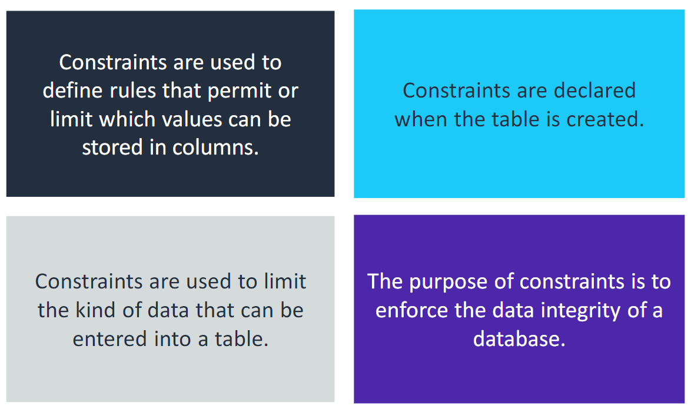

# Structured Query Language (SQL)

**SQL** (Structured Query Language) is a standard programming language used for working with relational databases. It allows for:

-   **Querying and Manipulating Data**: SQL provides commands to retrieve, insert, update, and delete data within a database.
-   **Defining Database Structures**: SQL enables the creation, modification, and management of database structures, including tables, indexes, and views.

SQL is widely adopted due to its robust capabilities and consistency across relational database management systems (RDBMS), making it essential for developers, data analysts, and database administrators.

### SQL Sublanguage Groups

SQL is composed of different sublanguages, each designed for specific functions in managing and interacting with data in a relational database:

-   **Data Manipulation Language (DML)**  
    DML provides commands to view, add, modify, or delete data within tables. Examples of DML commands include `SELECT`, `INSERT`, `UPDATE`, and `DELETE`.
    **Note:** The `SELECT` statement is a limited DML command; it reads data and can perform operations on it before returning the results.

-   **Data Definition Language (DDL)**  
    DDL is used to define and manage the database schema. This includes creating, altering, and deleting database objects such as tables, columns, indexes, and data types. Common DDL commands are `CREATE`, `ALTER` / `ALTER TABLE`, and `DROP`.
    **Note:** The `CREATE` statement can also be used to create other database objects, such as views or indexes.

-   **Data Control Language (DCL)**  
    DCL manages access permissions and controls who can interact with the data. Used typically by database administrators and programmers to enforce security in a database. Examples include `GRANT` (to give permissions) and `REVOKE` (to remove permissions).

Each of these sublanguage groups plays a critical role in organizing, securing, and interacting with the data within a relational database.

<br>

## Basic SQL elements

### Predefined Data Types

Predefined data types, also known as built-in data types, are commonly used in SQL for defining the type of data that can be stored in a database. The range of permissible values for numeric data types depends on the specific database management system (DBMS) in use.

### Identifiers in SQL

-   **Identifiers** represent names of objects (such as tables and columns) created by the user, as opposed to SQL keywords or commands.
-   **Best Practice:** Capitalize SQL language keywords and commands, while keeping identifiers in lowercase to improve readability and prevent confusion.

### Handling of Identifiers by Different DBMS

Each database management system (DBMS) has unique rules for handling capitalization of identifiers:

-   **IBM and Oracle:** Convert identifiers to uppercase automatically unless enclosed in double quotes (`" "`), which preserves the original case.
-   **Microsoft SQL Server:** Configurable to be case-sensitive or not, with case sensitivity linked to collation settings. By default, it is case-sensitive.
-   **MySQL Server:** Generally case-sensitive, except in Windows environments.

**Bad Practice:**

```sql
create Table CITY (id INTEGER NoT nULL PRImARY_KEY, name varchar(20) DEFAULT NULL, countrycode varchar(25) NOT NULL, district INTEGER NOT NULL);
```

**Good Practice:**

```sql
CREATE TABLE city (id INTEGER NOT NULL PRIMARY KEY, name VARCHAR(20) DEFAULT NULL, countrycode VARCHAR(25) NOT NULL, district INTEGER NOT NULL);
```

### Constraints on Data

Constraints enforce rules on the type and integrity of data that can be entered into a table. They are defined when creating a table and ensure consistency within the database by limiting the values or patterns that can be stored in specific columns.



#### Common SQL Constraints

-   **NOT NULL**: Ensures that a column cannot contain `NULL` values, enforcing that each row must have a value for this column.

    -   Example: `CREATE TABLE Employees (ID INT NOT NULL, Name VARCHAR(50) NOT NULL);`

-   **UNIQUE**: Requires that all values in a column or a set of columns are unique across rows.

    -   Example: `CREATE TABLE Users (UserID INT UNIQUE, Email VARCHAR(100) UNIQUE);`

-   **DEFAULT**: Specifies a default value for a column if no value is provided during insertion.

    -   Example: `CREATE TABLE Orders (OrderID INT, Status VARCHAR(20) DEFAULT 'Pending');`

-   **PRIMARY KEY**: Identifies a column (or set of columns) as the primary identifier for rows in a table, combining both `NOT NULL` and `UNIQUE` constraints.
    -   Example: `CREATE TABLE Products (ProductID INT PRIMARY KEY, Name VARCHAR(100));`

#### Purpose of Constraints

Constraints help enforce data integrity in a database by ensuring that:

-   Columns defined as **NOT NULL** always contain values.
-   **UNIQUE** constraints prevent duplicate entries in specific columns.
-   **DEFAULT** constraints ensure that required default values are set when no input is provided.
-   **PRIMARY KEY** constraints create a unique identifier for each row, making each entry identifiable.

By defining these constraints, database administrators and developers can maintain accurate, consistent, and reliable data across tables.

## Reserved Terms and Keywords in SQL

**Reserved terms** are specific SQL keywords or symbols that have predefined meanings within SQL commands. These terms are essential to the syntax of SQL and are interpreted in a specific way by the database.

### Guidelines for Using Reserved Terms

-   **Avoid using reserved terms** as ++names for databases, tables, columns, or other database objects++, as they can cause syntax errors or unexpected behavior.
-   Some database management systems (DBMS) allow reserved keywords to be used as object names if they are enclosed in delimiters (e.g., `"column"`). However, this practice is **not recommended** for clarity and compatibility across DBMS.

### Examples of Reserved Terms

#### Symbols

-   **#**
-   **;**
-   **:**
-   **@**

#### Keywords

-   **ADD**
-   **CLOSE**
-   **DATABASE**
-   **EXISTING**

By following these best practices, you can avoid potential conflicts and maintain clearer, more portable SQL code.

## Tables

### Naming Tables: Purposeful Naming Conventions

Selecting purposeful names (identifiers) for database elements is crucial for clarity and usability. Consider the following factors when developing your naming conventions:

### Key Factors to Consider:

-   **DBMS Rules and Limitations**: Be aware of any specific constraints imposed by the database management system regarding name length and allowable characters.
-   **Organizational Naming Conventions**: Adhere to any existing naming standards within your organization to maintain consistency across projects.
-   **Clarity**: Choose names that are self-explanatory and reflect the purpose of the table or column.

### Recommended Practices for Naming Tables and Elements

-   **Use Descriptive Names**: Ensure that the names clearly describe the entity being modeled. For example, instead of naming a table `tbl1`, use `Customers` or `OrderDetails`.

-   **Consistency in Pluralization**: Decide whether to use singular or plural forms for table names (e.g., `Customer` vs. `Customers`) and stick to your choice throughout the database.

-   **Consistent Formatting**: Establish a format for compound table names and use it consistently. Common formats include:
    -   **Camel Case**: `orderDetails`
    -   **Underscore**: `order_details`

By following these conventions, you can create a well-structured and easily navigable database that enhances maintainability and clarity.

## CREATE TABLE Statement

A table is a logically organized unit of data storage in SQL. To create a new table, you can use the `CREATE TABLE` statement.

### Basic Syntax

To create a table, the syntax is as follows:

```sql
CREATE TABLE table_name (
    column_name data_type constraints,
    ...
);
```

Conditional Table Creation - to create a table only if it does not already exist, you can use the IF NOT EXISTS clause:

```sql
CREATE TABLE IF NOT EXISTS table_name (
    column_name data_type constraints,
    ...
);
```

## Columns

-   Each column in a SQL table has a specific data type that defines the kind of data it can hold.
-   Some data types may require one or more parameters. For instance, a parameter can specify a maximum length for string data types.

### Column Definition Syntax

In a `CREATE TABLE` statement, separate column definitions with commas. The general syntax for a column definition is as follows:
`column_name DATA_TYPE [(length)] [NOT NULL] [DEFAULT value]`

The SQL example below illustrates a typical format for a column definition:

```sql
CREATE TABLE example_table (
    column1 VARCHAR(50) NOT NULL DEFAULT 'default_value',
    column2 INTEGER,
    column3 DATE
);
```

In this example:

column1 is defined as a VARCHAR data type with a maximum length of 50 characters, cannot be NULL, and has a default value of 'default_value'.
column2 is defined as an INTEGER data type and can accept NULL values.
column3 is defined as a DATE data type, which also allows NULL values.

## Primary Keys (PKs) and Foreign Keys (FKs)

### Primary Key

-   A **primary key** is a special column in a table that has a unique value for each row, thereby uniquely identifying that row.
-   A table can have zero or one primary key (PK).
-   The primary key can consist of a single column or multiple columns, known as a **compound primary key**.

### Foreign Key

-   A **foreign key** is a special column in a table that holds the primary key value from another table.
-   A foreign key creates a relationship between the two tables, allowing for data integrity and referential constraints.
-   The primary key of one table can be defined as a foreign key in another table to establish a relationship between the two tables.

### Example

Consider two tables: `Customers` and `Orders`.

-   **Customers Table**

    ```sql
    CREATE TABLE Customers (
        CustomerID INT PRIMARY KEY,
        Name VARCHAR(100),
        Email VARCHAR(100) UNIQUE
    );
    ```

-   **Orders Table**

    ```sql
    CREATE TABLE Orders (
        OrderID INT PRIMARY KEY,
        OrderDate DATE,
        CustomerID INT,
        FOREIGN KEY (CustomerID) REFERENCES Customers(CustomerID)
    );
    ```

In this example:

-   `CustomerID` in the `Customers` table is the primary key.
-   `CustomerID` in the `Orders` table serves as a foreign key, referencing the primary key of the `Customers` table to create a relationship between the two tables.

**Referential integrity** is a database quality that ensures every non-NULL foreign key value matches an existing primary key value in another table. This concept is crucial for maintaining the accuracy and consistency of data across related tables.

## DROP TABLE Statement

To remove a table from a database, you can use the `DROP TABLE` statement:

```sql
DROP TABLE table_name1 [, table_name2] ... [, table_nameN];
```

-   This statement permanently removes the specified table(s) and all of its data from the database.
-   When deleting multiple tables, separate each table name with a comma in the DROP TABLE statement.

```sql
DROP TABLE Customers, Orders;
```

#### Character Strings Data Types

-   **CHARACTER (CHAR)**:

    -   Fixed-length string of text.
    -   Values must be enclosed in single quotation marks (e.g., `'text'`).

-   **CHARACTER VARYING (VARCHAR)**:

    -   Variable-length string with a defined maximum length.

-   **CHARACTER LARGE OBJECT (CLOB)**:
    -   A collection of character data, typically used for large text.

#### Numeric Types

-   **INTEGER**:

    -   Represents whole numbers. Range varies by DBMS (e.g., `-2147483648` to `2147483647`).

-   **SMALLINT**:

    -   Similar to INTEGER, but typically supports a smaller range (e.g., `-32768` to `32767`).

-   **BIGINT**:

    -   Similar to INTEGER, but supports a larger range (e.g., `-9223372036854775808` to `9223372036854775807`).

-   **DECIMAL(p, s)**:

    -   data type represents an exact number with a specified precision (`p`) and scale (`s`). It can have a decimal point, making it suitable for exact numeric values (e.g, `DECIMAL(10, 3)` can store values like `1234567` or `1234567.123`)

-   **FLOAT(p)**:

    -   data type represents a floating-point number with a specified precision (`p`).

-   **REAL**:
    -   This data type is the same as the FLOAT type, except that the DBMS defines the precision.

#### Date and time data types

-   **DATE**: Represents a date.

    -   **Example Format**: `yyyy-mm-dd`

-   **TIME**: Represents a date.

    -   **Example Format**: `yyyy-mm-dd`

-**TIMESTAMP**: Represents a moment in time indicated by both a date and a time, combines the values of a `DATE` and a `TIME`

    -   **Example Format**: `yyyy-mm-dd hh:mm:ss`

#### Boolean Type

-   **BOOLEAN**: Stores `TRUE`, `FALSE`, or `NULL` values, often used in logical comparisons.
    -   Example: A `BOOLEAN` field could store `TRUE` to indicate an active status or `FALSE` for inactive.

#### Binary Data Types

-   **BLOB (Binary Large Object)**: Used to store binary data, such as images, audio, and other media types.
    -   Example: A `BLOB` might store an image file as binary data.
