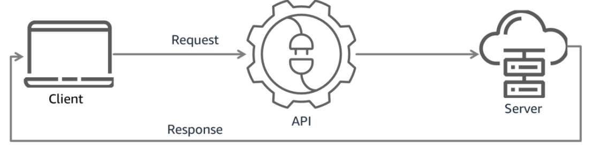

# What is an API?

An **Application Programming Interface (API)** provides programmatic access to an application's functions and features, enabling communication between different software programs.

## How APIs Work

1. The **client application** sends a request to the **server application** by using the server application's API.
2. The **server application** processes the request and returns a response to the client application.

## Benefits of an API

-   **Access Without GUI**: Allows access to an application's functionality without relying on a graphical user interface (GUI).
-   **Consistency**: Provides a standard and consistent way to invoke application functions programmatically.

## API vs. GUI

Most people interact with applications through a **graphical user interface (GUI)**. For example, the AWS Management Console is a GUI for interacting with AWS services. In contrast, APIs enable direct interaction between applications, bypassing the need for human interaction with a GUI.

## API Communication

APIs serve as intermediaries that allow applications to communicate with each other. This communication is initiated via an **API call**, which involves:

1. **Request**: A message sent to an application asking it to perform a specific function.
2. **Response**: A message sent back by the application with the requested data or outcome.

## Why Use APIs?

APIs are essential for developers to build applications that interact with other software. By defining a standard way of invoking application functions, APIs make it easier to integrate and extend the capabilities of software programs.

---

# What are RESTful APIs?

A **RESTful API** is an interface that enables two computer systems to exchange information securely over the internet. It is a widely used standard for creating web-based APIs that adhere to the principles of **Representational State Transfer (REST)**.

## Key Features of RESTful APIs

-   **Loosely Coupled**: Designed for applications that are network-based and loosely connected, promoting flexibility and scalability.
-   **Communication Over HTTP**: Uses HTTP protocols for efficient and reliable communication.
-   **Resource-Based**: Exposes resources at specific **Uniform Resource Identifiers (URIs)**, making it easy to interact with data and services.

## RESTful vs. Other API Standards

Many modern web APIs are RESTful because REST has become the dominant standard, replacing older protocols like **Simple Object Access Protocol (SOAP)**. REST APIs are valued for their simplicity, efficiency, and ability to support secure communication.

## Benefits of RESTful APIs

-   **Efficiency**: They provide a lightweight and fast mechanism for communication over HTTP.
-   **Reliability**: Follow secure communication principles, ensuring the integrity of data exchanged between systems.
-   **Popularity**: RESTful APIs are widely supported and used across various industries, making them a standard for web services.

RESTful APIs are particularly useful for building scalable and maintainable applications, making them a preferred choice for developers and organizations worldwide.

---

# REST Design Principles

REST (Representational State Transfer) is a widely used architectural style for web services. RESTful APIs rely on these components to enable seamless communication and resource sharing between clients and servers, ensuring a structured and consistent interaction model.
It follows five key design principles:

## 1. Uniform Interface

-   The client interacts with the server through a **uniform interface**.
-   Each distinct resource is accessed via a single **endpoint** or **URI**.
-   The interface does not mandate the structure of the data returned in a response, ensuring flexibility in implementation.

## 2. Statelessness

-   RESTful services are **stateless**, meaning the server does not maintain any information about the client’s previous requests or the steps completed in a sequence of actions.
-   Any session-related data is maintained solely on the client side.
-   The server remains unaware of the client's state, and the client does not need to know the server’s state.

## 3. Caching

-   REST clients should be able to **cache responses** from the REST server.
-   Proper caching can improve performance and reduce server load by reusing data instead of making repeated requests.

## 4. Layered System

-   REST supports **layered architectures**, allowing the client to connect to intermediate servers, such as proxies or load balancers.
-   This design enables distribution of the REST server across multiple systems, improving scalability and supporting **load balancing**.

## 5. Code on Demand (Optional)

-   RESTful services can optionally support **code on demand**, where the server sends executable code (e.g., JavaScript) to the client.
-   This extends the client's functionality by allowing it to execute the code provided by the server.
-   **Note**: Code on demand is an optional feature and is not widely adopted across RESTful API implementations.

---

# RESTful Components

RESTful APIs consist of four primary components: **Client**, **Resource**, **Request**, and **Response**. Each plays a distinct role in enabling communication between systems.

## 1. Client

-   **Definition**: The client is the user or software system that accesses information from the web using the API.
-   **Example**:
    -   A developer writes a program to access weather data from an API.
    -   Alternatively, a user directly accesses the same data by visiting the weather website via a browser.

## 2. Resource

-   **Definition**: A resource is the information provided by a server to clients. Resources can be of various types, such as images, videos, text, numbers, or any other data.
-   **Server**: The machine that provides the resource to the client is called the **server**.
-   **APIs and Resources**:
    -   Organizations use APIs to securely share resources while maintaining control and authentication.
    -   APIs also enable organizations to determine which clients have access to specific internal resources.

## 3. Request

-   **Definition**: A request is sent by the client to the server, formatted in a way that the server understands.
-   **Purpose**: The client specifies what resource or action it needs from the server.

## 4. Response

-   **Definition**: The response is the server's reply to the client’s request.
-   **Contents**:
    -   **Status Message**: Indicates success or failure of the request.
    -   **Message Body**: Contains the requested resource representation (if successful).
    -   **Metadata**: Provides additional information about the response.

# REST Request Format

A REST request consists of several key components: **Endpoint**, **Method**, **Header**, and **Body**. These elements work together to enable communication between clients and servers.

---

## 1. Endpoint (URL)

-   **Definition**: The endpoint specifies the location of the resource on the server.
-   **Format**: It is provided as a **URL**.
-   **Purpose**: The client uses the URL to notify the server about the specific resource it wants to interact with.

---

## 2. Method

Each resource in the REST API supports one or more methods. These define the desired operation:

-   **GET**: Requests the server to retrieve a resource.
-   **POST**: Requests the server to create a new resource.
-   **PUT**: Requests the server to edit or update an existing resource.
-   **DELETE**: Requests the server to remove a resource.

---

## 3. Header

-   **Definition**: The header contains **metadata** about the request.
-   **Examples**: Authorization tokens, content type, or custom application-specific information.

---

## 4. Body (Data)

-   **Definition**: The body contains the **data** that the client sends to the server.
-   **Use Cases**:
    -   **POST** or **PUT** methods typically include a body with details on how to create or update a resource.
    -   **GET** requests rarely include a body.

---

By combining these components, REST requests provide a structured and flexible way to interact with server resources in a standardized manner.
